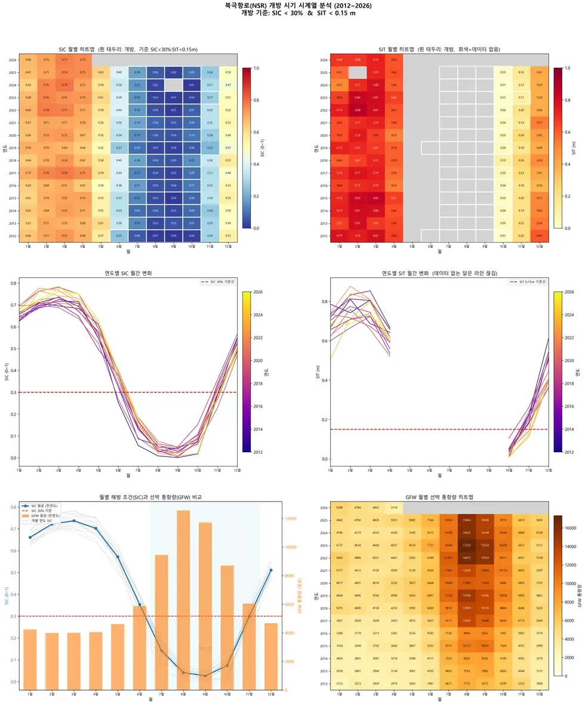

# applications/arctic-route

해빙 자료 + 선박 통항으로 북극항로 개방 시기를 산출한다.

## 결과 예시

이 폴더 코드로 만든 산출물입니다. 데이터는 저장소에 없고 그림만 참고용으로 둡니다.

*서부 구간 개방 패턴*

## 코드

| 파일 | 역할 | 입력 | 출력 |
|---|---|---|---|
| `gfw_vessels.py` | Global Fishing Watch API로 날짜별 선박 존재(vessel presence) 격자를 받아 저장 | ZIP | 텍스트/로그 |
| `nsr_analysis.py` | 북극항로 분석: SIC + SIT + GFW Vessel Presence (2026-03-01 단일 날짜) | GeoTIFF · 파일 묶음 | PNG 그림 |
| `nsr_opening_2012_2026.py` | NSR 개방 시기 시계열 분석 — 통합 스크립트 (분석 + 시각화 v2) | GeoTIFF · CSV · shp/GeoJSON · 파일 묶음 | CSV · PNG 그림 |
