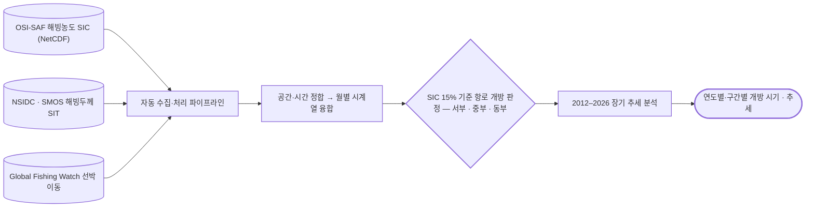

# applications/arctic-route

해빙 자료 + 선박 통항으로 북극항로 개방 시기를 산출함.

## 처리 흐름



> - 원통: 입력 자료 · 사각형: 처리 단계 · 마름모: 판정·검증 · 양끝 둥근 사각형: 산출물
> - GitHub 에서 자동 렌더링됨

---

## 코드

| 파일 | 역할 | 입력 | 출력 |
|---|---|---|---|
| `gfw_vessels.py` | Global Fishing Watch API로 날짜별 선박 존재(vessel presence) 격자를 받아 저장 | ZIP | 텍스트/로그 |
| `nsr_analysis.py` | 북극항로 분석: SIC + SIT + GFW Vessel Presence (2026-03-01 단일 날짜) | GeoTIFF · 파일 묶음 | PNG 그림 |
| `nsr_opening_2012_2026.py` | NSR 개방 시기 시계열 분석 — 통합 스크립트 (분석 + 시각화 v2) | GeoTIFF · CSV · shp/GeoJSON · 파일 묶음 | CSV · PNG 그림 |

---

## 실행

> 새 영상·새 자료가 들어왔을 때 이 모듈만으로 결과까지 가는 순서임.
> 아래 인자와 상수는 코드에서 그대로 뽑은 것임.

### 환경

```bash
conda activate pyps      # geopandas · rasterio
```

- 환경 정의: [`environment/`](../../environment/)

### 환경변수

| 이름 | 설명 |
|---|---|
| `GFW_API_TOKEN` | Global Fishing Watch API 토큰 |

### 상수를 고쳐 돌리는 스크립트

- 명령줄 인자가 없음. 파일 위쪽 상수를 대상 자료에 맞게 바꾼 뒤 `python <파일>` 로 실행함

| 파일 | 고칠 상수 | 현재값 |
|---|---|---|
| `nsr_opening_2012_2026.py` | `BASE_DIR` | `<DATA_ROOT>\14_NSR` |
|  | `SIC_THRESHOLD` | `0.3` |
|  | `SIT_THRESHOLD` | `0.15` |

- 명령줄 인자가 없는 스크립트 — 파일 안의 입력 경로를 확인한 뒤 실행함: `gfw_vessels.py`
