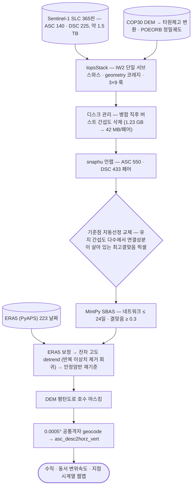

# applications/dam-monitoring

자연댐 변위 모니터링 — 성분 분해와 계절성 분석.

## 처리 흐름

> - 원통: 입력 자료 · 사각형: 처리 단계 · 마름모: 판정·검증 · 양끝 둥근 사각형: 산출물
> - GitHub 에서 자동 렌더링됨

---

## 하위

| 디렉터리 | 내용 |
|---|---|
| [`verify/`](verify/) | 결과 재계산 검증. |

## 코드

| 파일 | 역할 | 입력 | 출력 |
|---|---|---|---|
| `diag_era5.py` | Diagnose whether ERA5 tropo correction removed the topo-correlated velocity residual. | HDF5 | — |
| `export_dsc_corrected.py` | DSC LOS velocity with an EMPIRICAL stratified-tropo correction (remove the strong velocity~elevation trend tha | HDF5 · 파일 묶음 | JSON |
| `make_dsc_corr_map.py` | Standalone HTML: Esri imagery + water-masked, AOI-cropped DSC LOS velocity. The RAW velocity field (float32) i | JSON | 텍스트/로그 |
| `plot_decomp.py` | Render ASC/DSC LOS + vertical/horizontal decomposition velocity maps to a PNG. | HDF5 | PNG 그림 |
| `seasonal_point.py` | Extract the seasonal cycle at the requested point: remove the linear trend, then (a) fit annual+semiannual sin | JSON | PNG 그림 |
