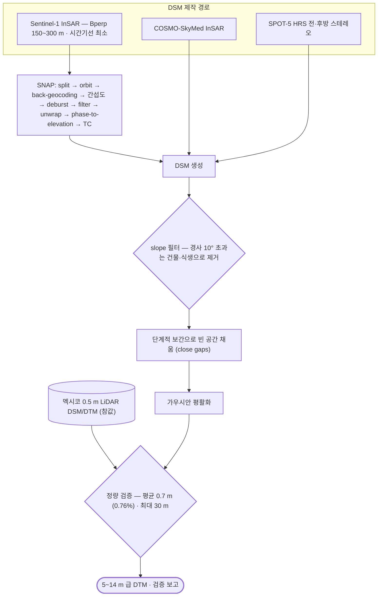

# applications/dem-generation

**DTM 제작.** 고해상도 지형자료가 없는 지역에서 저비용으로 5~10 m DTM 을 만들 수 있는지 — InSAR DSM · 스테레오 · LiDAR 세 경로를 비교함. DSM 생성은 `sar/sentinel-1/` 과 SNAP 에서, 여기엔 LiDAR 처리와 정확도 검증만 둠.

## 처리 흐름

> - 원통: 입력 자료 · 사각형: 처리 단계 · 마름모: 판정·검증 · 양끝 둥근 사각형: 산출물
> - GitHub 에서 자동 렌더링됨

---

## 하위

| 디렉터리 | 내용 |
|---|---|
| [`lidar/`](lidar/) | LiDAR 포인트/래스터 수집·병합·재투영 — 검증용 참값(0.5 m) 준비. |
| [`validation/`](validation/) | 제작 DTM 과 참값의 오차 산출. 멕시코 LiDAR 지역이 유일한 정량 검증지였음. |
