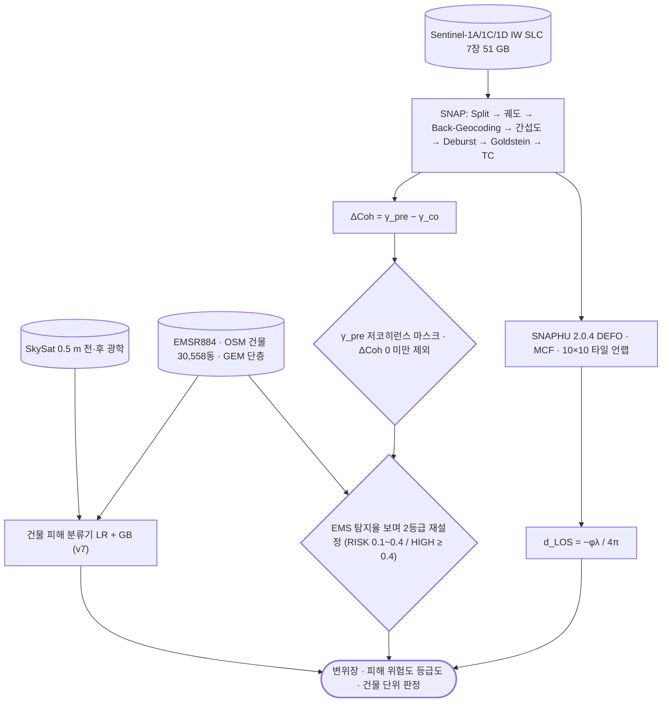

# applications/disaster-damage/earthquake

지진 피해 등급화 — CCD + 건물 레이어 + 도로 노출.

## 처리 흐름



> - 원통: 입력 자료 · 사각형: 처리 단계 · 마름모: 판정·검증 · 양끝 둥근 사각형: 산출물
> - GitHub 에서 자동 렌더링됨

---

## 하위

| 디렉터리 | 내용 |
|---|---|
| [`aux/`](aux/) | 단층 등 보조 레이어 추출. |
| [`verify/`](verify/) | 보고서 수치를 원본에서 재계산해 검증함. |

## 코드

| 파일 | 역할 | 입력 | 출력 |
|---|---|---|---|
| `catia_la_mar_buildings.py` | Catia La Mar (La Guaira, Venezuela) 건물 footprint 추출 스크립트 | CSV | shp/GeoJSON |
| `catia_lamar_ccd_analysis.py` | Catia La Mar CCD 집중 분석 | GeoTIFF · CSV · shp/GeoJSON | shp/GeoJSON · PNG 그림 · 텍스트/로그 |
| `catia_lamar_final_report.py` | Catia La Mar 종합 분석 보고서 v3 | GeoTIFF · shp/GeoJSON | PNG 그림 · 텍스트/로그 |
| `fusion_report_v5.py` | 2026 베네수엘라 M7.5 지진 - HTML 보고서 v5 | GeoTIFF · shp/GeoJSON · 이미지 | PNG 그림 |
| `gis_quant_analysis_v2.py` | GIS 정량 분석 v2 — 2등급 재분류 (신뢰도 기반 임계치) | GeoTIFF · shp/GeoJSON | GeoTIFF · shp/GeoJSON · PNG 그림 · 텍스트/로그 |

---

## 실행

> 새 영상·새 자료가 들어왔을 때 이 모듈만으로 결과까지 가는 순서임.
> 아래 인자와 상수는 코드에서 그대로 뽑은 것임.

### 환경

```bash
conda activate pyps      # geopandas · rasterio
```

- 환경 정의: [`environment/`](../../../environment/)

### 상수를 고쳐 돌리는 스크립트

- 명령줄 인자가 없음. 파일 위쪽 상수를 대상 자료에 맞게 바꾼 뒤 `python <파일>` 로 실행함

| 파일 | 고칠 상수 | 현재값 |
|---|---|---|
| `catia_la_mar_buildings.py` | `OUT_SHP` | `catia_la_mar_buildings.shp` |
|  | `OUT_GPKG` | `catia_la_mar_buildings.gpkg` |
|  | `MS_INDEX` | `https://minedbuildings.z5.web.core.windows.net/global-buildings/dat…` |
