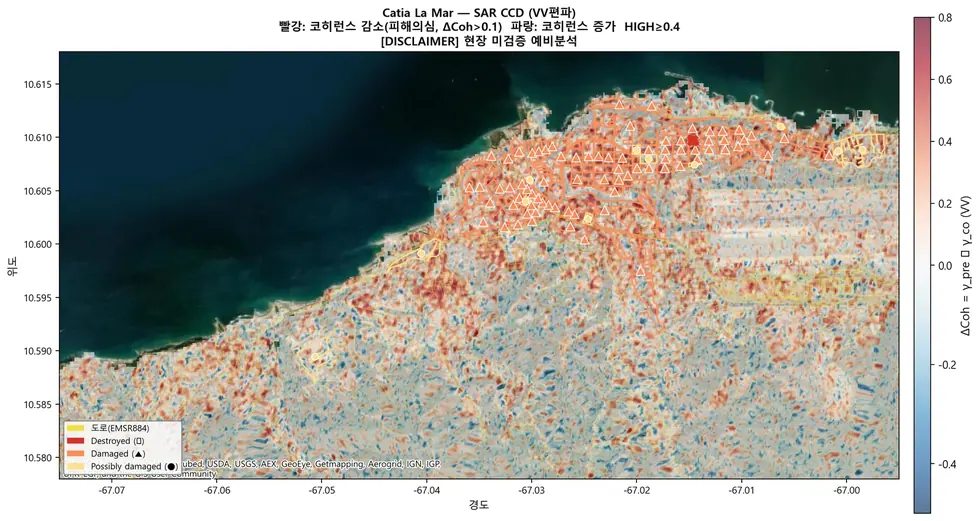

# applications/disaster-damage/earthquake

지진 피해 등급화 — CCD + 건물 레이어 + 도로 노출.

## 하위

| 디렉터리 | 내용 |
|---|---|
| [`aux/`](aux/) | 단층 등 보조 레이어 추출. |
| [`verify/`](verify/) | 보고서 수치를 원본에서 재계산해 검증한다. |

## 결과 예시

이 폴더 코드로 만든 산출물입니다. 데이터는 저장소에 없고 그림만 참고용으로 둡니다.

*피해 의심구역 등급 지도*

## 코드

| 파일 | 역할 | 입력 | 출력 |
|---|---|---|---|
| `catia_la_mar_buildings.py` | Catia La Mar (La Guaira, Venezuela) 건물 footprint 추출 스크립트 | CSV | shp/GeoJSON |
| `catia_lamar_ccd_analysis.py` | Catia La Mar CCD 집중 분석 | GeoTIFF · CSV · shp/GeoJSON | shp/GeoJSON · PNG 그림 · 텍스트/로그 |
| `catia_lamar_final_report.py` | Catia La Mar 종합 분석 보고서 v3 | GeoTIFF · shp/GeoJSON | PNG 그림 · 텍스트/로그 |
| `fusion_report_v5.py` | 2026 베네수엘라 M7.5 지진 - HTML 보고서 v5 | GeoTIFF · shp/GeoJSON · 이미지 | PNG 그림 |
| `gis_quant_analysis_v2.py` | GIS 정량 분석 v2 — 2등급 재분류 (신뢰도 기반 임계치) | GeoTIFF · shp/GeoJSON | GeoTIFF · shp/GeoJSON · PNG 그림 · 텍스트/로그 |
