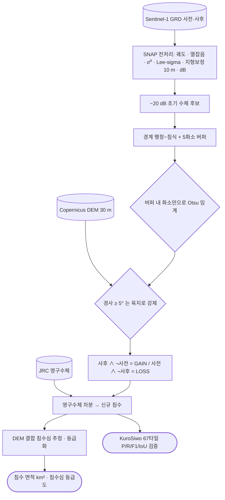

# applications/disaster-damage/flood

돌발홍수 피해 — 탐지 결과를 노출·경로 분석으로 확장.

## 처리 흐름

> - 원통: 입력 자료 · 사각형: 처리 단계 · 마름모: 판정·검증 · 양끝 둥근 사각형: 산출물
> - GitHub 에서 자동 렌더링됨

<!-- crosslink -->
### 쓴 기법

- 아래는 **재사용 가능한 처리**이고, 이 폴더는 그것을 특정 사건에 적용한 **사례 분석**임

| 기법 | 이 사례에서 맡은 몫 |
|---|---|
| [`sar/sentinel-1/water/flood/`](../../../sar/sentinel-1/water/flood/) | Edge-Otsu 수체 분리와 전후 차분 |
<!-- crosslink -->

---

## 하위

| 디렉터리 | 내용 |
|---|---|
| [`render/`](render/) | 지도·카드뉴스 렌더링. |

## 코드

| 파일 | 역할 | 입력 | 출력 |
|---|---|---|---|
| `corridor_matched2.py` | 고도+기준결맞음 2차원 매칭 검정 — 2026 네팔 홍수 | GeoTIFF · JSON | — |
| `exposure.py` | 노출 분석 (인구 / 건물 / 도로 / 시설) — 2026 네팔 홍수 | GeoTIFF · JSON | JSON |
| `make_map.py` | 결맞음 변화 지도 생성 — 2026 네팔 홍수 | GeoTIFF · JSON | PNG 그림 |
| `nrsc_check.py` | NRSC/ISRO(Charter Call 1209 AOI-02)가 지목한 인프라 피해가 우리 SAR에서 보이는지 검증. | GeoTIFF | PNG 그림 · JSON |
| `source_scar.py` | 빙하 붕괴 원점의 붕괴 흔적(scar) 탐지 — 2026 네팔 홍수 | GeoTIFF | — |

---

## 실행

> 새 영상·새 자료가 들어왔을 때 이 모듈만으로 결과까지 가는 순서임.
> 아래 인자와 상수는 코드에서 그대로 뽑은 것임.

### 환경

- 표준 과학 스택(numpy · pandas · matplotlib)이면 충분함

### 환경변수

| 이름 | 설명 |
|---|---|
| `DATA_ROOT` | 원본·중간 산출물이 놓인 데이터 루트 |

- 명령줄 인자가 없는 스크립트 — 파일 안의 입력 경로를 확인한 뒤 실행함: `corridor_matched2.py`, `exposure.py`, `make_map.py`, `nrsc_check.py`, `source_scar.py`
