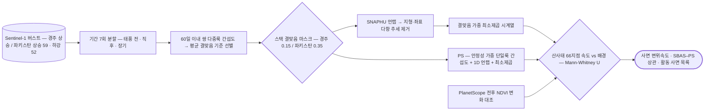

# applications/disaster-damage/landslide

산사태 지점 검증.

## 처리 흐름



> - 원통: 입력 자료 · 사각형: 처리 단계 · 마름모: 판정·검증 · 양끝 둥근 사각형: 산출물
> - GitHub 에서 자동 렌더링됨

<!-- crosslink -->
### 쓴 기법

- 아래는 **재사용 가능한 처리**이고, 이 폴더는 그것을 특정 사건에 적용한 **사례 분석**임

| 기법 | 이 사례에서 맡은 몫 |
|---|---|
| [`sar/sentinel-1/insar/sbas/`](../../../sar/sentinel-1/insar/sbas/) | 짧은 기선 시계열 |
| [`sar/sentinel-1/insar/psinsar/`](../../../sar/sentinel-1/insar/psinsar/) | 영구산란체 시계열 |
<!-- crosslink -->

---

## 코드

| 파일 | 역할 | 입력 | 출력 |
|---|---|---|---|
| `validate_points.py` | Landslide-point validation of PyGMTSAR velocity maps (Gyeongju). | GeoTIFF | — |

---

## 실행

> 새 영상·새 자료가 들어왔을 때 이 모듈만으로 결과까지 가는 순서임.
> 아래 인자와 상수는 코드에서 그대로 뽑은 것임.

### 환경

```bash
conda activate pyps      # geopandas · rasterio
```

- 환경 정의: [`environment/`](../../../environment/)

### 환경변수

| 이름 | 설명 |
|---|---|
| `DATA_ROOT` | 원본·중간 산출물이 놓인 데이터 루트 |
