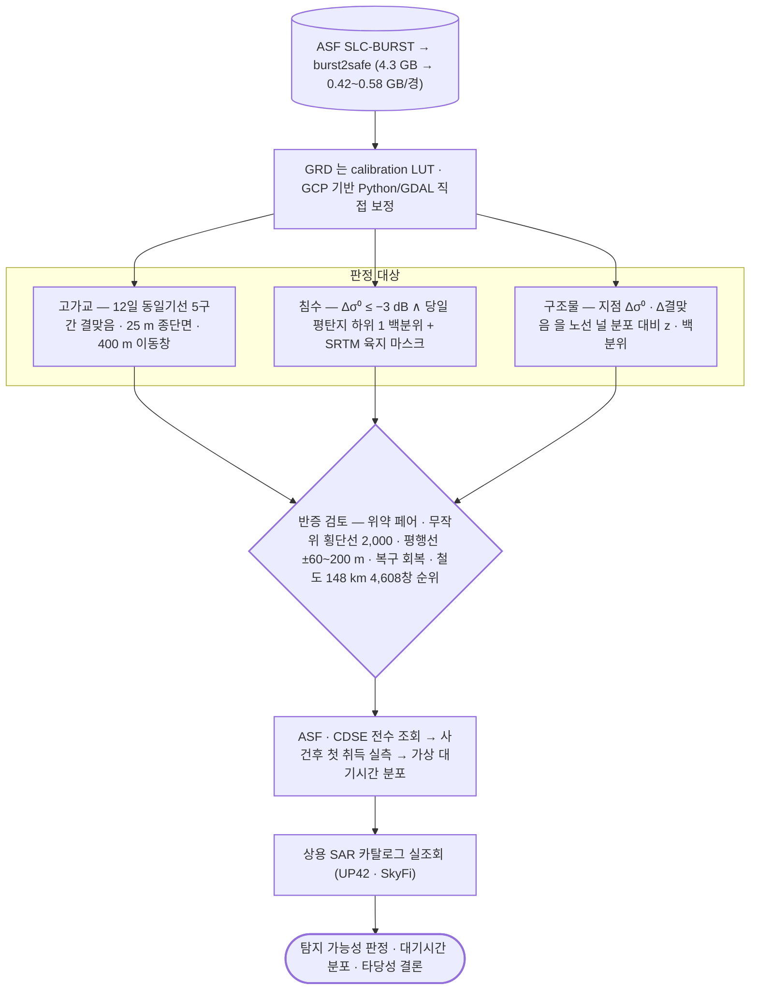

# applications/rail-hazard

철도 재해 SAR 탐지 타당성 — 대상 선정부터 탐지 가능성 종합까지.

## 처리 흐름



> - 원통: 입력 자료 · 사각형: 처리 단계 · 마름모: 판정·검증 · 양끝 둥근 사각형: 산출물
> - GitHub 에서 자동 렌더링됨

<!-- crosslink -->
### 쓴 기법

- 아래는 **재사용 가능한 처리**이고, 이 폴더는 그것을 특정 사건에 적용한 **사례 분석**임

| 기법 | 이 사례에서 맡은 몫 |
|---|---|
| [`sar/sentinel-1/change-detection/coherence/`](../../sar/sentinel-1/change-detection/coherence/) | 구간 결맞음 변화 |
| [`sar/sentinel-1/water/flood/`](../../sar/sentinel-1/water/flood/) | 침수 판정 |
<!-- crosslink -->

---

## 하위

| 디렉터리 | 내용 |
|---|---|
| [`catalog/`](catalog/) | 대상 구간(고가교·노선) 추출. |
| [`figures/`](figures/) | 근거 그림 생성. |

## 코드

| 파일 | 역할 | 입력 | 출력 |
|---|---|---|---|
| `damage_extent_survey.py` | 과거 재해의 피해 범위를 「얼마나 넓게, 얼마나 길게 퍼지는가」로 정리함. | GeoTIFF · NumPy | — |
| `revisit_stats.py` | 사건 후 첫 SAR 취득까지 걸리는 시간의 분포 — 「지바의 +10.2 h 를 일반화할 수 있는가」에 답함. | JSON | — |
| `run.sh` | 분석 env 실행 래퍼. CONDA_PREFIX 의 python 을 직접 호출하므로 PROJ/GDAL 데이터 경로를 명시함. PYTHONPATH는 ISCE2 경로 오염을 피하기 위해 비움. | — | — |

---

## 실행

> 새 영상·새 자료가 들어왔을 때 이 모듈만으로 결과까지 가는 순서임.
> 아래 인자와 상수는 코드에서 그대로 뽑은 것임.

### 환경

```bash
conda activate pyps      # geopandas · rasterio
```

- 환경 정의: [`environment/`](../../environment/)

### 환경변수

| 이름 | 설명 |
|---|---|
| `WORK_ROOT` | 작업 디렉터리 루트 |

- 명령줄 인자가 없는 스크립트 — 파일 안의 입력 경로를 확인한 뒤 실행함: `damage_extent_survey.py`, `revisit_stats.py`
