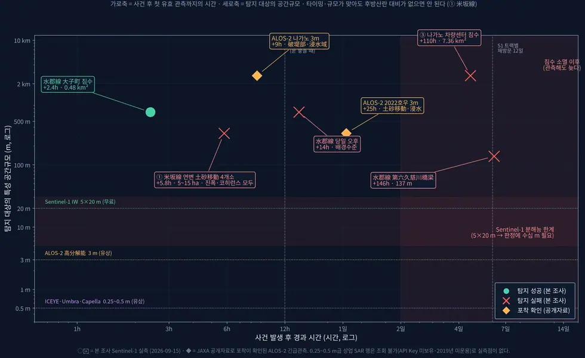

# applications/rail-hazard

철도 재해 SAR 탐지 타당성 — 대상 선정부터 탐지 가능성 종합까지.

## 하위

| 디렉터리 | 내용 |
|---|---|
| [`catalog/`](catalog/) | 대상 구간(고가교·노선) 추출. |
| [`figures/`](figures/) | 근거 그림 생성. |

## 결과 예시

이 폴더 코드로 만든 산출물입니다. 데이터는 저장소에 없고 그림만 참고용으로 둡니다.

*탐지 가능성 평가*

## 코드

| 파일 | 역할 | 입력 | 출력 |
|---|---|---|---|
| `damage_extent_survey.py` | 과거 재해의 피해 범위를 「얼마나 넓게, 얼마나 길게 퍼지는가」로 정리한다. | GeoTIFF · NumPy | — |
| `revisit_stats.py` | 사건 후 첫 SAR 취득까지 걸리는 시간의 분포 — 「지바의 +10.2 h 를 일반화할 수 있는가」에 답한다. | JSON | — |
| `run.sh` | 분석 env 실행 래퍼. CONDA_PREFIX 의 python 을 직접 호출하므로 PROJ/GDAL 데이터 경로를 명시한다. PYTHONPATH는 ISCE2 경로 오염을 피하기 위해 비운다. | — | — |
