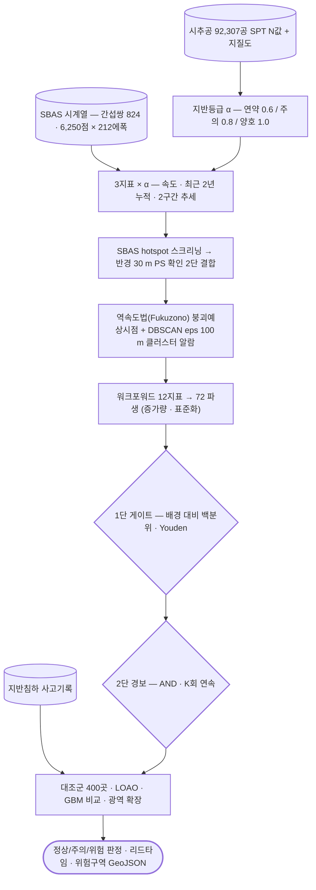

# applications/subsidence-warning

지반침하 조기경보 — 사고 자료 수집부터 규칙·리드타임 백테스트까지.

## 처리 흐름

> - 원통: 입력 자료 · 사각형: 처리 단계 · 마름모: 판정·검증 · 양끝 둥근 사각형: 산출물
> - GitHub 에서 자동 렌더링됨

---

## 하위

| 디렉터리 | 내용 |
|---|---|
| [`01_accident_data/`](01_accident_data/) | 지반침하 사고 이력 수집·지오코딩 (공공데이터). |
| [`02_fusion_poc/`](02_fusion_poc/) | InSAR 변위 + 지반 등급 + 지하수를 융합해 지표를 만듦. |
| [`03_alarm_pipeline/`](03_alarm_pipeline/) | AOI 단위 경보 파이프라인 — 속도 역수(invvel) 기반 판정. |
| [`04_leadtime_rules/`](04_leadtime_rules/) | 경보 규칙과 **리드타임 백테스트**. 과적합 검사(LOAO)도 함께. |
| [`05_point_grade_demo/`](05_point_grade_demo/) | 지점 등급 판정 데모. |
| [`06_recheck/`](06_recheck/) | 판정 결과 재검증. |
| [`hotspots/`](hotspots/) | 침하 핫스팟 추출·검증. |
