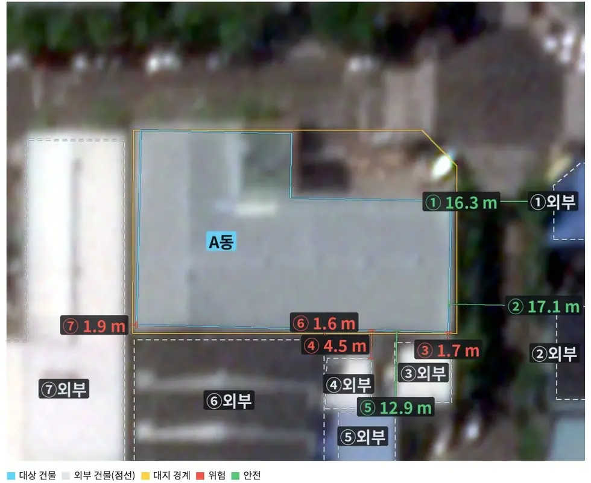
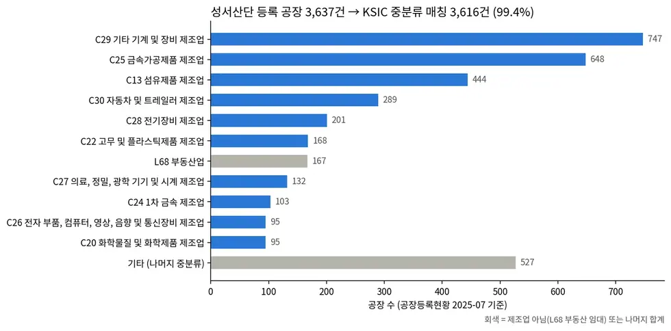

# applications/underwriting

공간정보 기반 중소 공장 인수심사 — 건물통합정보·업종 매칭.

## 결과 예시

이 폴더 코드로 만든 산출물입니다. 데이터는 저장소에 없고 그림만 참고용으로 둡니다.

*인접 물건 분리*

*업종 구성*

## 코드

| 파일 | 역할 | 입력 | 출력 |
|---|---|---|---|
| `factory_by_sgg.py` | GIS건물통합정보(대구)에서 시군구별 전체/주용도=공장 건물 수, 달서구 공장 상위 법정동 집계. | — | — |
| `fig_ksic_mix.py` | 성서산단 등록 공장의 KSIC 중분류 구성 막대그림 (ksic_link.py 의 매칭 결과 사용). | — | PNG 그림 |
| `fig_source_coverage.py` | 자료원별 커버리지(특건 공백률) 그림 | PNG | PNG 그림 |
| `fig_workflow.py` | 인수심사 워크플로 도식 | PNG | PNG 그림 |
| `ksic_link.py` | 주소(지번) → 공장등록현황 업종명 → 한국표준산업분류(KSIC 11차) 대·중분류 연결. | CSV | — |
| `profile_dbf.py` | GIS건물통합정보 shapefile 속성(A0~A33) 데이터기반 프로파일링. | — | — |
| `profile_phase0.py` | Phase 0 - 대구 산업단지 기업 등록현황 CSV 프로파일링. | CSV | — |
| `special_bld_gap.py` | 특수건물(특건) 공백 산출 — 성서산단 공장 중 연면적 3,000㎡ 미만 비율. | PNG | PNG 그림 |
| `verify_field_mapping.py` | 애매한 필드 정밀 검증: ID 유일성, A15 관계, A35 형식, 면적/율 관계식. | — | — |

## 주요 인자

- `ksic_link.py` — `--coverage`
- `special_bld_gap.py` — `--fig`
