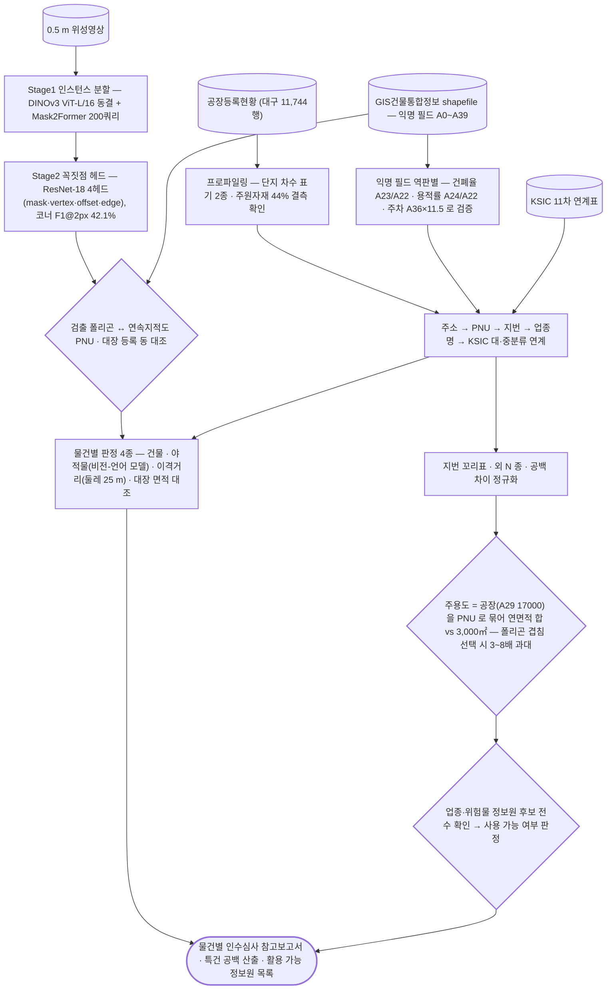

# applications/underwriting

공간정보 기반 중소 공장 인수심사 — 건물통합정보·업종 매칭.

## 처리 흐름

> - 원통: 입력 자료 · 사각형: 처리 단계 · 마름모: 판정·검증 · 양끝 둥근 사각형: 산출물
> - GitHub 에서 자동 렌더링됨

---

## 하위 모듈

| 폴더 | 무엇인지 | 입력 | 출력 |
|---|---|---|---|
| [`building-seg/`](building-seg/) | 위성영상에서 건물을 **벡터 폴리곤**으로 뽑는 2단 모델. Stage1 인스턴스 분할(DINOv3 ViT-L/16 동결 + Mask2Former), Stage2 꼭짓점 헤드(ResNet-18 4헤드) | 0.5 m/px 장면 PNG | `<scene>_masks.npz` → `<scene>_polys.json` |
| [`report-gen/`](report-gen/) | 지번 주소 하나로 **건물·야적물·이격거리·대장 대조** 네 판정을 내고 물건별 보고서를 생성 | 주소 문자열, 정사영상, 공공 API 2종, VLM | `result.json`, GeoJSON 4종, `summary.md`, 보고서 HTML·PDF |
| [`geopipe/`](geopipe/) | 대장·지적·멸실 수집 플랫폼 — **미포함**(사유는 폴더 README) | — | — |

### 모델 성능 (오염 제거한 scene val band, 778 instances)

| 지표 | v1 규칙기반 | v2 꼭짓점헤드 |
|---|---:|---:|
| 코너 F1@2px | 26.5 % | **42.1 %** |
| 평균 IoU | 0.807 | **0.825** |
| C-IoU | 0.743 | **0.780** |
| PoLiS (낮을수록 좋음) | 3.09 | **2.75** |
| 평균 정점수 (GT 4.83) | 5.11 | **4.87** |

- recall 은 0.656 → 0.657 로 사실상 동일함 — 같은 탐지기를 쓰므로 당연한 결과임
- 한계: v2 가 이웃 폴리곤과 면적 0.73 % 중복(v1 은 0.02 %). 크롭별 독립생성 탓이며 위 지표에 안 잡히는 회귀임
- 학습자료 6,425동 · 31,097꼭짓점 · 0.5 m/px · 4개 지역. 상세는 [`building-seg/doc/`](building-seg/doc/)

### 가중치와 라이선스

- Stage2 `best.pth`(51 MB) 는 [`building-seg/model/`](building-seg/model/) 에 포함함
- Stage1 `best_ep08.pth`(1.32 GB) 는 용량 때문에 미포함. 구조·하이퍼파라미터·결과는 `model/stage1_run7_config.json` 에 전량 수록함
- Stage1 체크포인트에는 gated 백본 `facebook/dinov3-vitl16-pretrain-lvd1689m` 이 동결된 채 들어 있어 **재배포 시 해당 라이선스를 따름**. 그래서 저장소에는 구조·설정만 두고 가중치는 두지 않음

---

## 코드

| 파일 | 역할 | 입력 | 출력 |
|---|---|---|---|
| `factory_by_sgg.py` | GIS건물통합정보(대구)에서 시군구별 전체/주용도=공장 건물 수, 달서구 공장 상위 법정동 집계. | — | — |
| `fig_ksic_mix.py` | 성서산단 등록 공장의 KSIC 중분류 구성 막대그림 (ksic_link.py 의 매칭 결과 사용). | — | PNG 그림 |
| `fig_source_coverage.py` | 자료원별 커버리지(특건 공백률) 그림 | PNG | PNG 그림 |
| `fig_workflow.py` | 인수심사 워크플로 도식 | PNG | PNG 그림 |
| `ksic_link.py` | 주소(지번) → 공장등록현황 업종명 → 한국표준산업분류(KSIC 11차) 대·중분류 연결. | CSV | — |
| `profile_dbf.py` | GIS건물통합정보 shapefile 속성(A0~A33) 데이터기반 프로파일링. | — | — |
| `profile_phase0.py` | Phase 0 - 대구 산업단지 기업 등록현황 CSV 프로파일링. | CSV | — |
| `special_bld_gap.py` | 특수건물(특건) 공백 산출 — 성서산단 공장 중 연면적 3,000㎡ 미만 비율. | PNG | PNG 그림 |
| `verify_field_mapping.py` | 애매한 필드 정밀 검증: ID 유일성, A15 관계, A35 형식, 면적/율 관계식. | — | — |

## 주요 인자

- `ksic_link.py` — `--coverage`
- `special_bld_gap.py` — `--fig`
