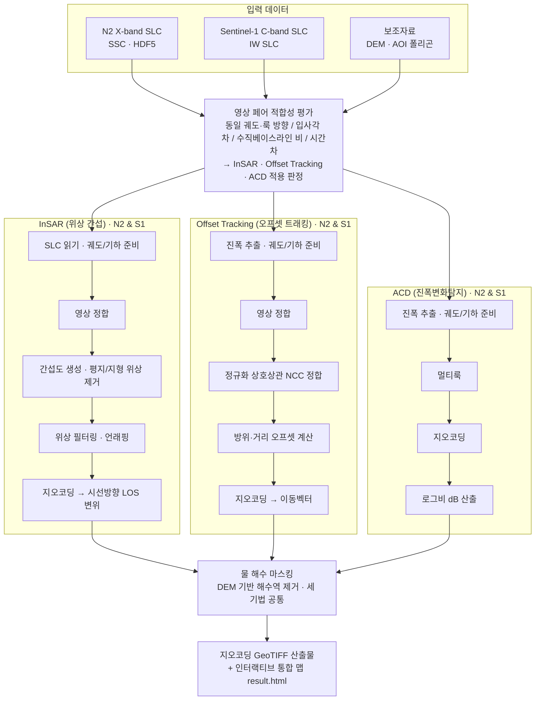

# 태안 해안사구 SAR 분석 - 처리 프로토콜 및 방법론 (답변 자료)

## 1. 질문 답변: "N2, S1 모두 ISCE2로 진행한 게 맞나요?"

**아니요. 전부 ISCE2는 아닙니다.** 기법·센서별로 다릅니다.

| 분석 기법 | N2 (X-band) | S1 (C-band) |
|---|---|---|
| **InSAR (위상 간섭)** | **자체 파이썬 파이프라인** (ISCE2가 N2 미지원) | **공식 ISCE2 topsApp v2.6.3** |
| **Offset Tracking** | 자체 파이썬 (진폭 상관) | 자체 파이썬 (진폭 상관) |
| **ACD (진폭변화탐지)** | 자체 파이썬 | 자체 파이썬 |

핵심 포인트:
- **ISCE2를 쓴 것은 S1 위상 InSAR 하나뿐**입니다 (페어: S1C x S1C, 0519 x 0531, 12일. ISCE 2.6.3이 Sentinel-1D를 미지원해 S1C 동일센서 페어 사용).
- **N2 위상 InSAR은 자체 파이썬**으로 처리했습니다. ISCE2/SNAP/GAMMA 등 어떤 상용·공개 SAR SW도 국산 차세대소형위성 2호를 네이티브 지원하지 않기 때문에, 궤도 상태벡터와 Zero-Doppler 타이밍부터 직접 구현했습니다.
- **Offset Tracking과 ACD는 N2·S1 모두 자체 파이썬**으로, ISCE2와 무관합니다.

> 즉 "타 기관에서 하고 싶어도 못 내놓는" 부분의 실체가 바로 이것입니다 - **국산 위성(N2)으로 InSAR/OT를 실제로 수행하려면 처리기를 직접 만들어야** 하고, 저희가 그것을 구현했습니다.

---

## 2. 처리 프로토콜 순서도 (draw.io)

파일: **`Result/taean_SAR_protocol.drawio`** (diagrams.net / draw.io 에서 File > Open 으로 열어 편집·발표 자료화 가능)

세 기법(InSAR · Offset Tracking · ACD)을 **동일한 5단계 수준**으로 정렬했고, 각 기법은 **N2·S1 양쪽**에 동일하게 적용합니다. 아래는 동일 내용의 미리보기(Mermaid)입니다.

- **방위·거리 오프셋 계산**: 상호상관 피크를 포물선 보간으로 소수 화소(1/10~1/20 화소)까지 정밀 추정해 방위·거리 이동량을 산출.
- **물(해수) 마스킹**은 세 기법 모두 공통(DEM 기반 해수역 제거)이라 공통 단계로 표기.

---

## 3. "자체 코드가 믿을만한가"에 대한 답변

**핵심: "코드가 맞는가"와 "결과가 좋은가"는 다른 질문입니다.** 결과가 약한 것은 X-band가 사구에서 수 일 내 탈상관하는 물리적 한계 때문이며, 같은 데이터를 ISCE2에 넣어도 동일합니다. 코드의 정확성은 결과의 강약과 **독립적으로** 확인됩니다.

**1층 - 기하·지오코딩 (가장 객관적)**
- 표준 **제로도플러 + 궤도 상태벡터 + DEM** 기하 모델을 구현.
- 잔차 위치오차(약 24.5 m)를 **DEM 수직기준(지오이드 융기량)** 으로 정확히 귀속시킬 수 있음 → 오차의 물리적 원인까지 짚어낸다는 것 자체가 기하 모델이 정합적이라는 방증.

**2층 - 알고리즘 표준성**
- 간섭도 생성, 평지/지형 위상 제거, 정규화 상호상관(NCC) 정합, 부화소 피크 추정, 로그비 산출 - 전부 **공개 표준 알고리즘**이며 새로 발명한 것이 아님.
- 부호 규약은 **합성신호(알고 있는 이동을 주입)로 검증**해 맞춤.

**3층 - 외부 도구 대조 (정직한 경계)**
- S1에서 처리 초·중반 단계(정합·평지/지형 위상 제거·필터링)가 ISCE2와 일치함을 확인.
- 다만 TOPS의 정밀 방위정합(ESD)/리램프는 간이 구현이므로, **S1 최종 언래핑까지 ISCE2와 동일하다고는 주장하지 않음** (이 한계를 먼저 밝히는 것이 신뢰를 만듦).

> 보고회 답변 예시: "코드 신뢰성은 결과의 강약과 분리해서 봐야 합니다. 결과가 약한 건 X-band 사구의 물리적 탈상관 때문이고 ISCE2도 동일합니다. 코드 자체는 ① 표준 제로도플러+궤도+DEM 기하로 잔차 위치오차를 DEM 지오이드 기준으로 정확히 귀속시킬 만큼 정합적이고 ② 사용 알고리즘이 전부 공개 표준이며 부호는 합성신호로 검증했고 ③ S1에서 ISCE2와 초·중반 처리단계가 일치함을 확인했습니다. 다만 TOPS의 정밀정합/리램프는 간이 구현이라 S1 최종 언래핑까지 동일하다고는 보지 않습니다."

---

## 4. 보고회 메소드 어필 포인트 (방점 제안)

결과의 크기가 아니라 **방법론**에 방점을 찍기 좋은 근거들입니다.

1. **국산 위성(N2)의 InSAR/OT를 상용 SW 없이 처리한 것 자체가 성과**
   - ISCE2·SNAP·GAMMA 어느 것도 N2를 지원하지 않음 → 궤도 기하(상태벡터·Zero-Doppler)부터 자립형 파이프라인을 구현. "하고 싶어도 못 하던" 기술적 이유(툴 부재)가 명확.

2. **다중기법 x 다중밴드 통합 프레임워크**
   - InSAR(위상) + Offset Tracking(진폭 상관) + ACD(진폭 변화)를 X-band(N2)·C-band(S1) 양쪽에 동일 절차로 교차 적용.

3. **물리 기반 적합성·한계 진단 (실패조차 방법론적 기여)**
   - 결과가 약한 이유를 정량 규명: X-band 사구는 수 일 내 급속 탈상관, 30~35일 위상 InSAR 불가, 입사각 차·베이스라인 비 기반 페어 적합성 판정. "왜 안 되는가"를 수치로 제시.

4. **재현 가능한 스크립트 파이프라인**
   - 전 과정을 스크립트화, 산출물은 지오코딩 GeoTIFF + 인터랙티브 맵으로 표준화.

---

## 5. 한 줄 프레이밍 제안

> "결과의 변위량이 아니라, **국산 위성으로 InSAR·Offset Tracking·ACD를 실제 수행하고, 적용 한계를 물리적으로 규명한 처리 방법론**에 방점."
