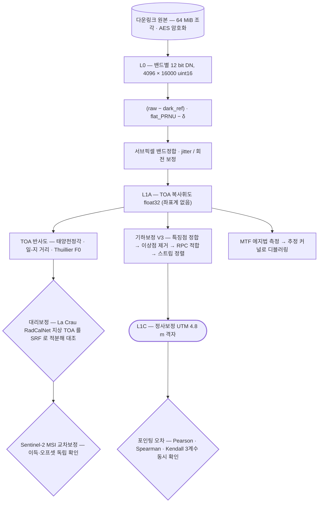

# eo/bluebon

**BlueBON — 자사 초소형 위성.** L0 원시 패킷부터 L1C 까지의 전처리 전 과정과, 그 위에 올린 응용. 센서를 직접 다루는 유일한 모듈이라 복사보정·기하보정·MTF 가 모두 들어 있음.

## 처리 흐름

> - 원통: 입력 자료 · 사각형: 처리 단계 · 마름모: 판정·검증 · 양끝 둥근 사각형: 산출물
> - GitHub 에서 자동 렌더링됨

---

## 먼저 볼 문서

| 문서 | 내용 |
|---|---|
| [`SPEC.md`](SPEC.md) | **센서 사양** — 밴드 구성·SRF 가중 중심·TDI별 포화 DN·검출기·처리 레벨·정량 분석 시 주의 |
| [`OVERVIEW.md`](OVERVIEW.md) | 전체 처리 흐름과 코드별 상세, **알려진 문제 12건** |
| [`THIRD_PARTY.md`](THIRD_PARTY.md) | 포함하지 않은 제3자 라이브러리와 업스트림 |
| [`../../docs/reports/bluebon-pointing-error.md`](../../docs/reports/bluebon-pointing-error.md) | 포인팅 오차 상관분석 보고서 |

## 하위

| 디렉터리 | 내용 |
|---|---|
| [`deblur-mtf/`](deblur-mtf/) | **MTF 와 디블러링.** 에지법으로 MTF 를 재고, 추정한 커널로 흐림을 되돌림. |
| [`downstream/`](downstream/) | **응용.** L1C 영상을 받아 대기·해양·화질 쪽으로 확장한 작업들. |
| [`geometric/`](geometric/) | **기하보정 V3.** 특징점 정합으로 RPC 를 맞추고 스트립을 정렬함. 웹 UI 와 도커 구성 포함. |
| [`l0-to-l1a/`](l0-to-l1a/) | **L0 → L1A.** 원시 바이너리 패킷을 읽어 영상으로 만듦. FEE/CEM 텔레메트리 점검과 촬영 시험 스크립트 포함. |
| [`pointing/`](pointing/) | 포인팅 오차와 궤도·자세 메타데이터의 상관분석. |
| [`preprocessing-legacy/`](preprocessing-legacy/) | 로컬 PC 에 있던 구 전처리 스크립트 — 위 `l0-to-l1a/` 로 대체됐지만 배치 쉘 흐름 참고용으로 남겨 둠. |
| [`radiometric/`](radiometric/) | **복사보정.** DN 을 물리량(복사휘도·반사도)으로 바꾸고, 밴드 간 정합과 정확도를 검증함. |
| [`research/`](research/) | L0→L1 처리 연구 코드 — LUT 생성, 기하 시뮬레이션, 검출기 시험. |
