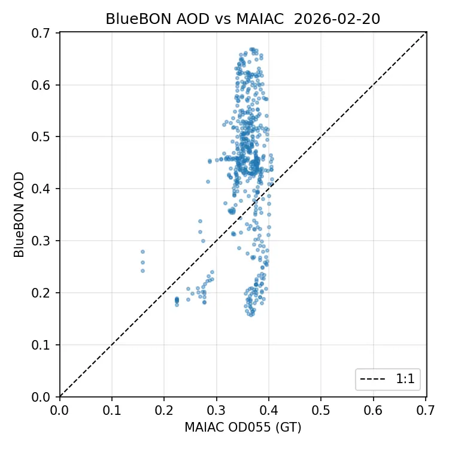
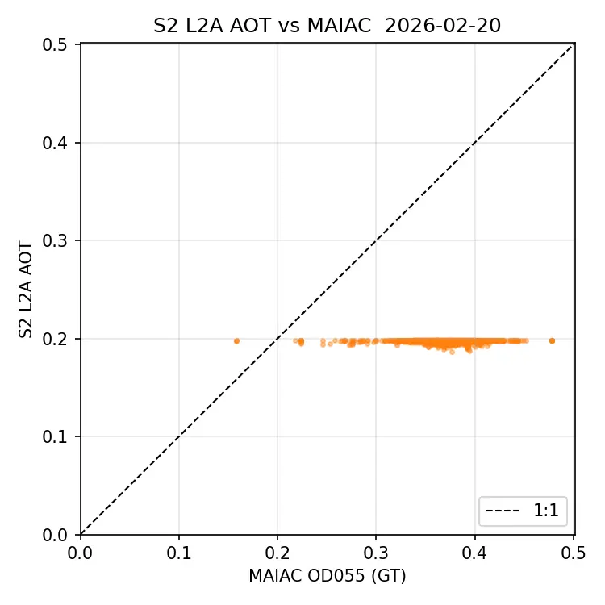

# eo/bluebon/downstream/aod

에어로졸 광학두께(AOD) 산출·검증 — MODIS MCD19A2 대조.

## 하위

| 디렉터리 | 내용 |
|---|---|
| [`BlueBON/`](BlueBON/) |  |
| [`S2/`](S2/) |  |
| [`bb_aod/`](bb_aod/) |  |

## 결과 예시

이 폴더 코드로 만든 산출물입니다. 데이터는 저장소에 없고 그림만 참고용으로 둡니다.

*BlueBON AOD vs MODIS MAIAC — N=538, Bias +0.007, RMSE 0.033, R 0.683*

*Sentinel-2 AOT vs MAIAC — 대조군*
