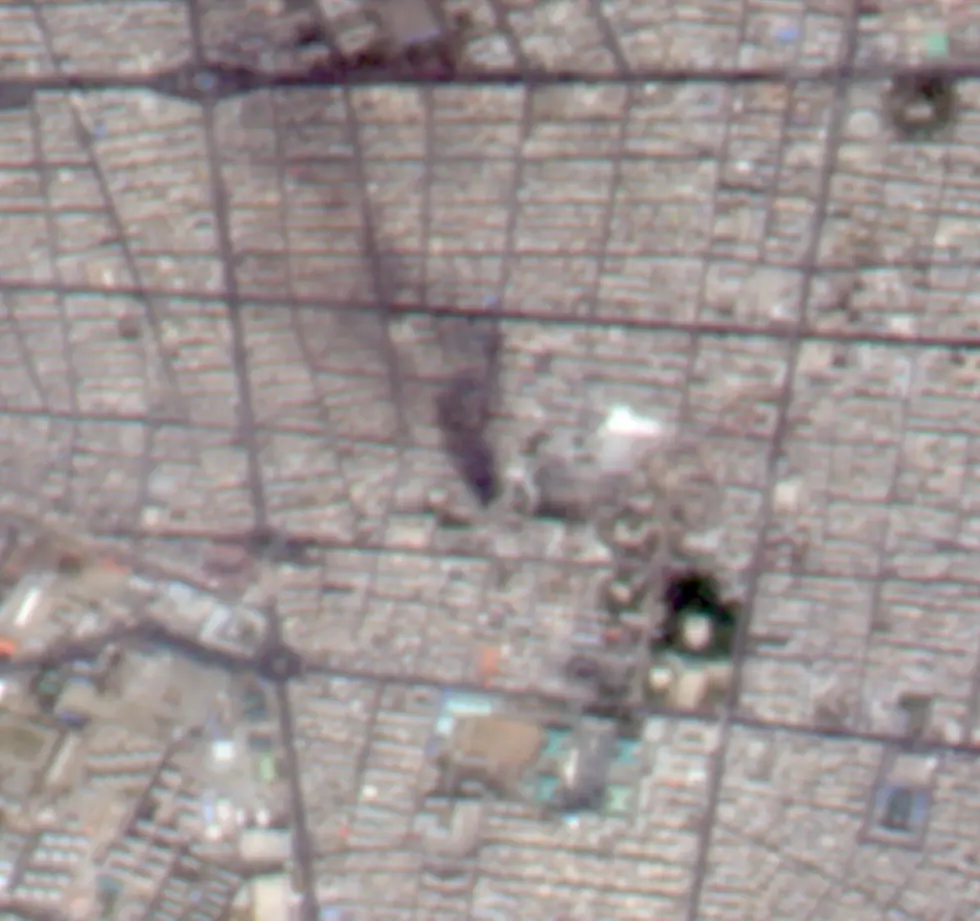

# eo/bluebon/downstream/dehazing

연무 제거 — 처리 파이프라인과 윈도우 GUI.

## 하위

| 디렉터리 | 내용 |
|---|---|
| [`DehazingGUI/`](DehazingGUI/) |  |
| [`src_dehaze/`](src_dehaze/) |  |

## 결과 예시

이 폴더 코드로 만든 산출물입니다. 데이터는 저장소에 없고 그림만 참고용으로 둡니다.

*연무 제거 전*

*연무 제거 후*
