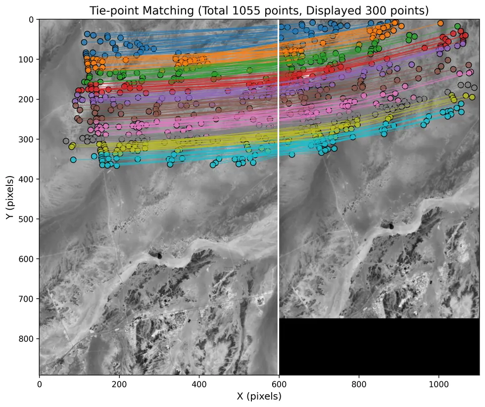
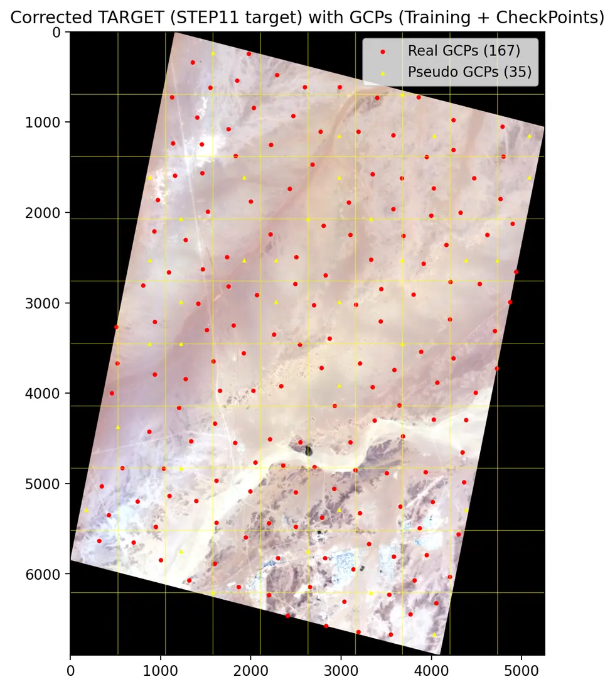

# eo/bluebon/geometric

**기하보정 V3.** 특징점 정합으로 RPC 를 맞추고 스트립을 정렬한다. 웹 UI 와 도커 구성 포함.

## 하위

| 디렉터리 | 내용 |
|---|---|
| [`Code/`](Code/) | 정합·RPC 적합·스트립 보정·일괄 처리. |
| [`docker/`](docker/) | 컨테이너 구성. |

## 결과 예시

이 폴더 코드로 만든 산출물입니다. 데이터는 저장소에 없고 그림만 참고용으로 둡니다.

*타이포인트 정합 — 기준영상(좌) ↔ 대상영상(우) 대응점*

*보정 후 대상영상과 GCP 분포*

## 코드

| 파일 | 역할 | 입력 | 출력 |
|---|---|---|---|
| `BlueBON.sh` | BlueBON Geometric Correction Web App 실행 스크립트 | — | — |
| `stop.sh` | 웹 서비스 중지 | — | — |
