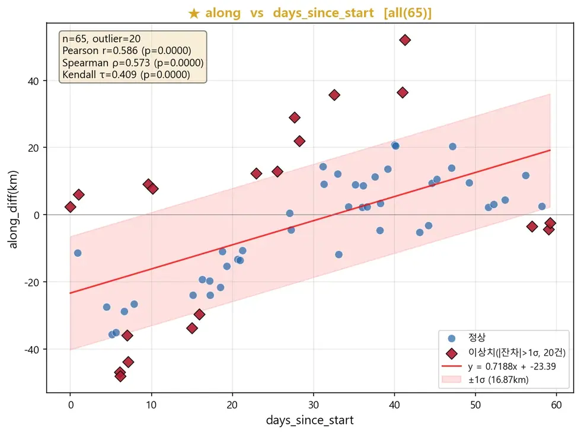
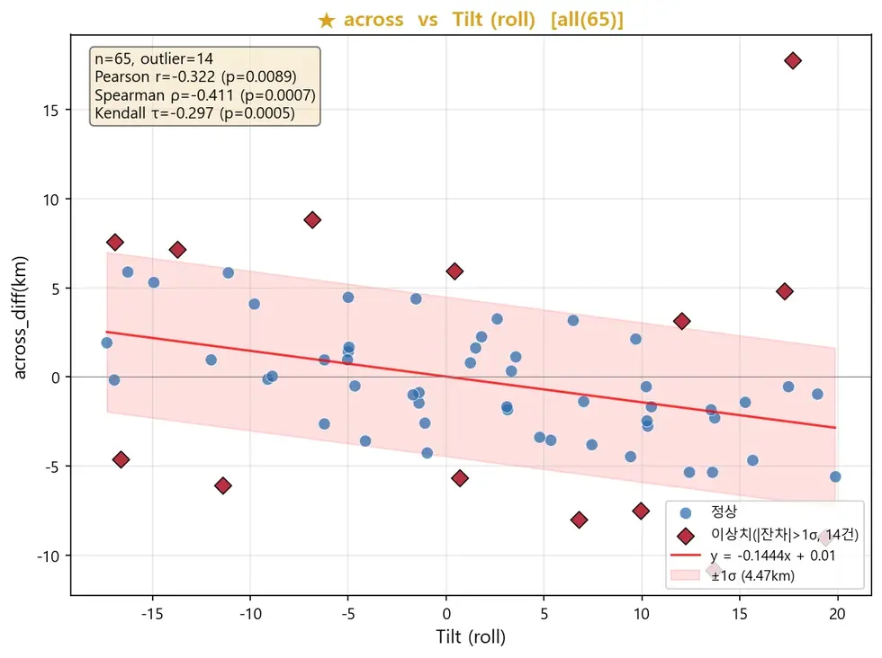

# eo/bluebon/pointing

포인팅 오차와 궤도·자세 메타데이터의 상관분석.

## 결과 예시

이 폴더 코드로 만든 산출물입니다. 데이터는 저장소에 없고 그림만 참고용으로 둡니다.

*along 오차 vs 경과일 — 시간 선형 드리프트 (r=0.586)*

*across 오차 vs Tilt(roll) — 자세 제어 영향 (r=−0.322)*

## 코드

| 파일 | 역할 | 입력 | 출력 |
|---|---|---|---|
| `along_across_cal.py` | 1. Haversine 거리 계산 (meters) | — | — |
| `analysis_combined.py` | Bluebon 포인팅 오차 통합 분석 | Excel | Excel · PNG 그림 |
| `build_analysis.py` | pointing_diff_20260408.xlsx + SatRev_metadata CSV 7개 | CSV · Excel | Excel |
| `pointing_across_along_cal.py` | 1. Haversine 거리 계산 (meters) | — | — |
| `run_pt.sh` | 포인팅 오차 산출 실행 | — | — |
