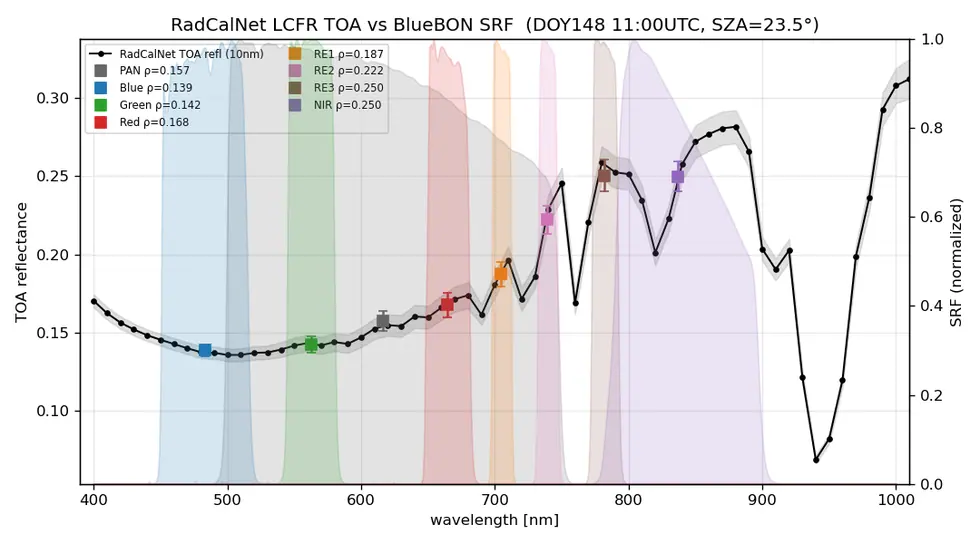
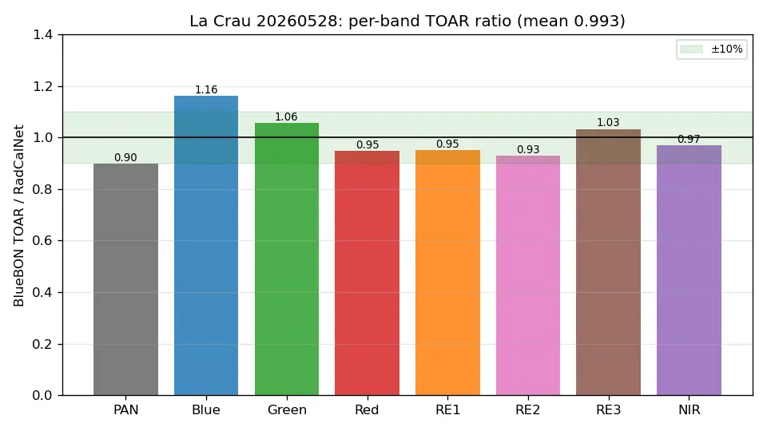
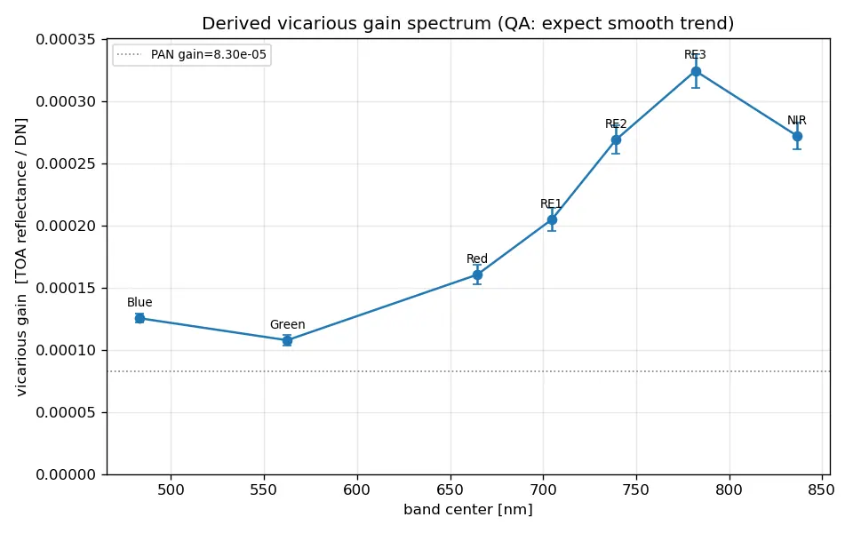
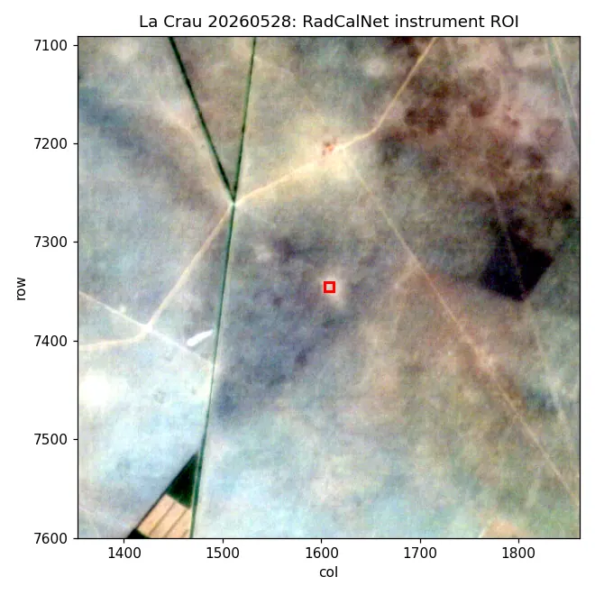

# eo/bluebon/radiometric

**복사보정.** DN 을 물리량(복사휘도·반사도)으로 바꾸고, 밴드 간 정합과 정확도를 검증한다.

## 하위

| 디렉터리 | 내용 |
|---|---|
| [`src/`](src/) | 복사보정 파이프라인 구현. |

## 결과 예시

이 폴더 코드로 만든 산출물입니다. 데이터는 저장소에 없고 그림만 참고용으로 둡니다.

*RadCalNet 지상 TOA 와 BlueBON 분광응답(SRF) 대조 — La Crau 검보정장*

*밴드별 TOA 반사도 비 — 평균 0.993*

*유도한 대리보정(vicarious) 이득 스펙트럼*

*검보정장 ROI — RadCalNet 계측기 위치*
