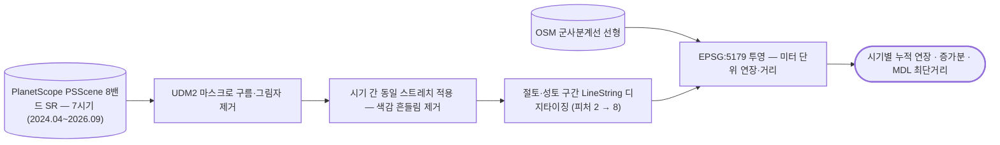

# eo/planetscope/change-detection

시기별 변화 디지타이징 결과를 미터 단위로 계량함. 산지 절토면은 나지와 분광이 비슷해 자동 분류가 흔들리므로, 대상이 선형이고 시기가 적을 때는 손으로 그리고 계산만 코드로 하는 편이 정확함.

## 처리 흐름



> - 원통: 입력 자료 · 사각형: 처리 단계 · 마름모: 판정·검증 · 양끝 둥근 사각형: 산출물
> - GitHub 에서 자동 렌더링됨

<!-- crosslink -->
### 이 기법을 쓴 사례

- 여기 코드는 어느 자료에도 쓸 수 있는 처리임. 아래는 실제로 적용한 사건별 분석임

| 사례 | 내용 |
|---|---|
| [`applications/underwriting/`](../../../applications/underwriting/) | 중소 공장 인수심사 — 건물 판독과 공간데이터 연계 |
<!-- crosslink -->

---

## 코드

| 파일 | 역할 | 입력 | 출력 |
|---|---|---|---|
| `measure_construction.py` | 시기별 공사현황 선형(shapefile)에서 누적 연장과 군사분계선까지 최단거리를 산출함. | shp/GeoJSON · 파일 묶음 | CSV |

## 주요 인자

- `measure_construction.py` — `--csv` `--mdl` `--works`

---

## 실행

> 새 영상·새 자료가 들어왔을 때 이 모듈만으로 결과까지 가는 순서임.
> 아래 인자와 상수는 코드에서 그대로 뽑은 것임.

### 환경

```bash
conda activate pyps      # geopandas · rasterio
```

- 환경 정의: [`environment/`](../../../environment/)

### 진입점

```bash
python measure_construction.py --works <값> --mdl <값>
```
시기별 공사현황 선형(shapefile)에서 누적 연장과 군사분계선까지 최단거리를 산출함. 디지타이징은 QGIS 에서 손으로 했고, 이 스크립트는 그 결과를 미터 단위로 재는 역할만 함. 경위도(EPSG:4326)에서 길이를 그대로 재면 위도에 따라 오차가 생기므로

| 인자 | 필수 | 기본값 | 설명 |
|---|---|---|---|
| `--works` | ● |  | 시기별 공사현황 shapefile 디렉터리 |
| `--mdl` | ● |  | 군사분계선 shapefile |
| `--csv` |  |  | 결과 CSV 경로 |
