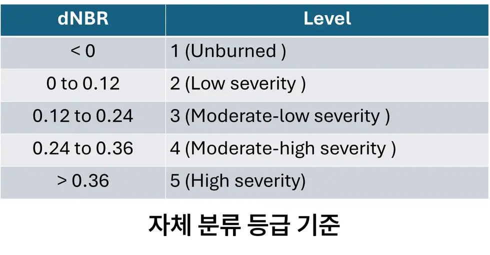
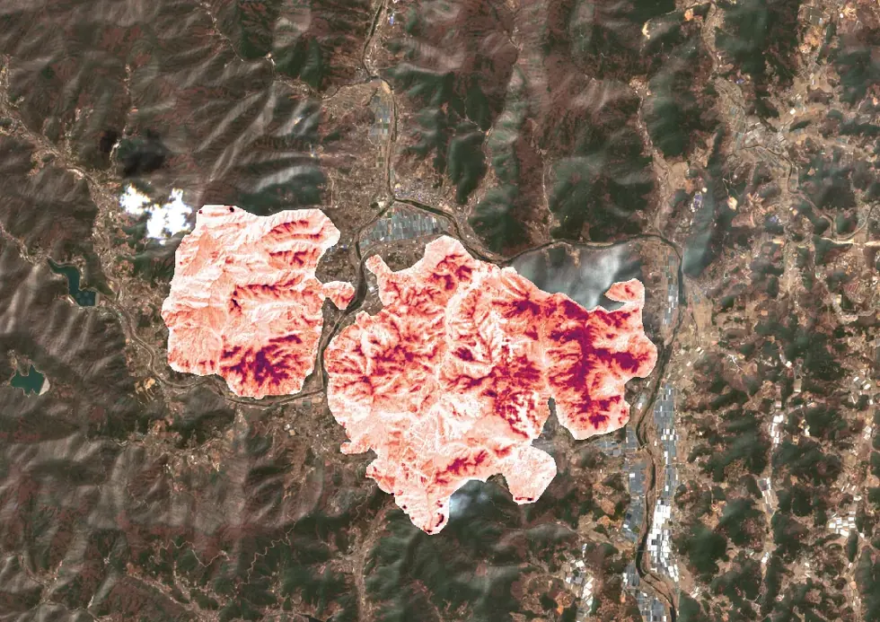

# eo/sentinel-2/burn-severity

**dNBR** 산불 피해등급 — 연소 후 NIR 감소·SWIR 증가를 쓴다.

## 하위

| 디렉터리 | 내용 |
|---|---|
| [`notebooks/`](notebooks/) | 영상 수집 → 구름·연기 마스킹 → dNBR → USGS 5등급 분류. |

## 결과 예시

이 폴더 코드로 만든 산출물입니다. 데이터는 저장소에 없고 그림만 참고용으로 둡니다.

*USGS dNBR 피해등급 임계값*

*dNBR 피해등급 분류 결과*
