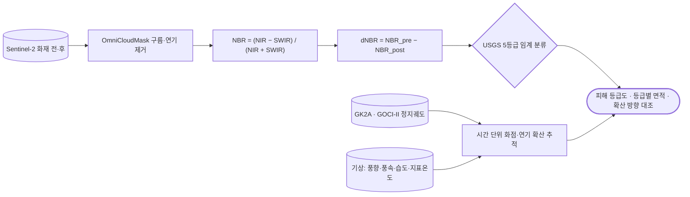

# eo/sentinel-2/burn-severity

**dNBR** 산불 피해등급 — 연소 후 NIR 감소·SWIR 증가를 씀.

## 처리 흐름

> - 원통: 입력 자료 · 사각형: 처리 단계 · 마름모: 판정·검증 · 양끝 둥근 사각형: 산출물
> - GitHub 에서 자동 렌더링됨

---

## 하위

| 디렉터리 | 내용 |
|---|---|
| [`notebooks/`](notebooks/) | 영상 수집 → 구름·연기 마스킹 → dNBR → USGS 5등급 분류. |
