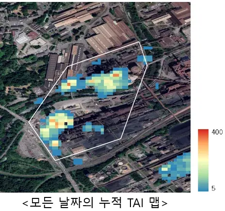
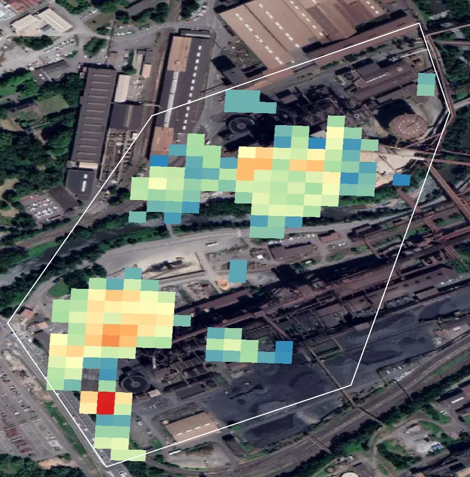

# eo/sentinel-2/thermal-anomaly

**TAI** 열이상지수 — SWIR이 고온체에 반응하는 성질로 제련소 가동을 판정한다.

## 하위

| 디렉터리 | 내용 |
|---|---|
| [`notebooks/`](notebooks/) | 단일 날짜 TAI, 누적 TAIsum, SWIR 위색 합성. |

## 결과 예시

이 폴더 코드로 만든 산출물입니다. 데이터는 저장소에 없고 그림만 참고용으로 둡니다.

*전체 관측일 누적 TAI 맵*

*TAI 열지도 — 용광로 위치가 분리된다*

## 코드

| 파일 | 역할 | 입력 | 출력 |
|---|---|---|---|
| `geocode_smelters.py` | Geocode copper smelters and write coordinates back to Excel. | Excel | Excel |

## 주요 인자

- `geocode_smelters.py` — `--cache` `--delay` `--email` `--input` `--output`
