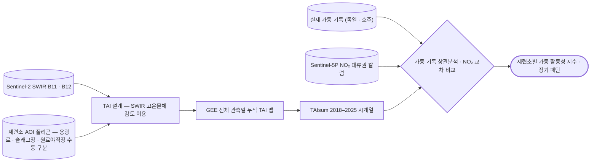

# eo/sentinel-2/thermal-anomaly

**TAI** 열이상지수 — SWIR이 고온체에 반응하는 성질로 제련소 가동을 판정함.

## 처리 흐름



> - 원통: 입력 자료 · 사각형: 처리 단계 · 마름모: 판정·검증 · 양끝 둥근 사각형: 산출물
> - GitHub 에서 자동 렌더링됨

---

## 하위

| 디렉터리 | 내용 |
|---|---|
| [`notebooks/`](notebooks/) | 단일 날짜 TAI, 누적 TAIsum, SWIR 위색 합성. |

## 코드

| 파일 | 역할 | 입력 | 출력 |
|---|---|---|---|
| `geocode_smelters.py` | Geocode copper smelters and write coordinates back to Excel. | Excel | Excel |

## 주요 인자

- `geocode_smelters.py` — `--cache` `--delay` `--email` `--input` `--output`

---

## 실행

> 새 영상·새 자료가 들어왔을 때 이 모듈만으로 결과까지 가는 순서임.
> 아래 인자와 상수는 코드에서 그대로 뽑은 것임.

### 환경

- 표준 과학 스택(numpy · pandas · matplotlib)이면 충분함

### 진입점

```bash
python geocode_smelters.py --input <값> --output <값>
```
Geocode copper smelters and write coordinates back to Excel. Changes per request: - Data rows start at Excel row **2** (1-indexed). Row 1 is header. -

| 인자 | 필수 | 기본값 | 설명 |
|---|---|---|---|
| `--input` | ● |  | Path to input Excel (e.g., smelters.xlsx) |
| `--output` | ● |  | Path to output Excel |
| `--cache` |  | `geocode_cache.json` | Path to cache JSON file |
| `--email` |  |  | (Optional) Contact email for Nominatim user agent |
| `--delay` |  | `1.0` | Extra polite delay seconds between requests (>=1.0 recommended) |
