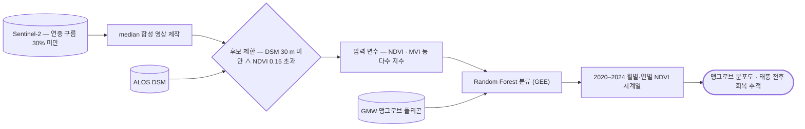

# eo/sentinel-2/vegetation

식생지수 시계열 — NDVI·EVI. 건조 기후에서는 일반 임계값이 작동하지 않아 다시 잡아야 함.

## 처리 흐름

> - 원통: 입력 자료 · 사각형: 처리 단계 · 마름모: 판정·검증 · 양끝 둥근 사각형: 산출물
> - GitHub 에서 자동 렌더링됨

---

## 코드

| 파일 | 역할 | 입력 | 출력 |
|---|---|---|---|
| `evi_highres.ipynb` | 고해상도 광학 EVI 산출 — 건조지역 임계값 조정 | GeoTIFF | GeoTIFF |
| `ndvi_timeseries.ipynb` | Sentinel-2 NDVI 시계열 산출 — 도시 녹지 분류 | GeoTIFF | GeoTIFF · 텍스트/로그 |
