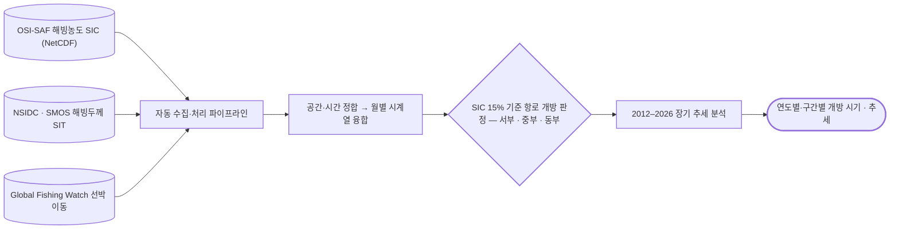

# passive-microwave/sea-ice

해빙 농도(SIC)·두께(SIT)·표류. OSI-SAF · NSIDC · SMOS.

## 처리 흐름

> - 원통: 입력 자료 · 사각형: 처리 단계 · 마름모: 판정·검증 · 양끝 둥근 사각형: 산출물
> - GitHub 에서 자동 렌더링됨

<!-- crosslink -->
### 이 기법을 쓴 사례

- 여기 코드는 어느 자료에도 쓸 수 있는 처리임. 아래는 실제로 적용한 사건별 분석임

| 사례 | 내용 |
|---|---|
| [`applications/arctic-route/`](../../applications/arctic-route/) | 북극항로 개방 시기 정량화 |
<!-- crosslink -->

---

## 하위

| 디렉터리 | 내용 |
|---|---|
| [`convert/`](convert/) | NetCDF → GeoTIFF (극지 투영 처리). |
| [`download/`](download/) | 원자료 자동 수집. |
| [`plot/`](plot/) | 월별 지도·표류 벡터장. |
