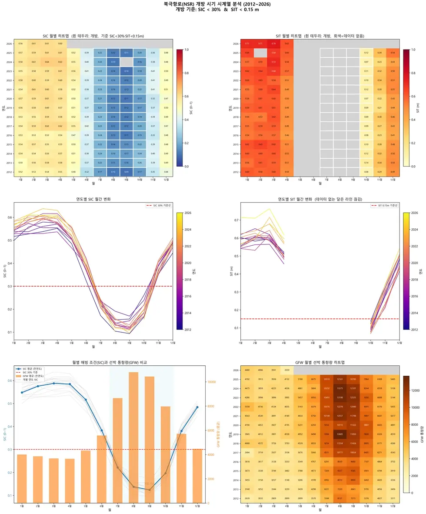

# passive-microwave/sea-ice

해빙 농도(SIC)·두께(SIT)·표류. OSI-SAF · NSIDC · SMOS.

## 하위

| 디렉터리 | 내용 |
|---|---|
| [`convert/`](convert/) | NetCDF → GeoTIFF (극지 투영 처리). |
| [`download/`](download/) | 원자료 자동 수집. |
| [`plot/`](plot/) | 월별 지도·표류 벡터장. |

## 결과 예시

이 폴더 코드로 만든 산출물입니다. 데이터는 저장소에 없고 그림만 참고용으로 둡니다.

*월별 SIC 히트맵 · 연도별 추세 · 개방 기간 분포*
