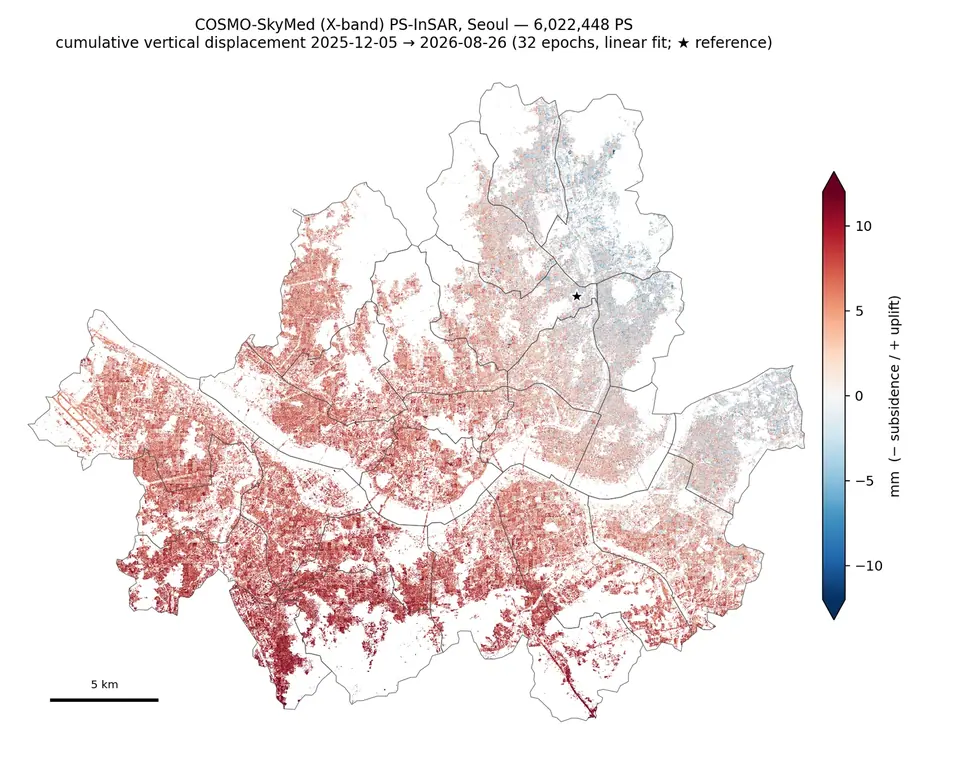
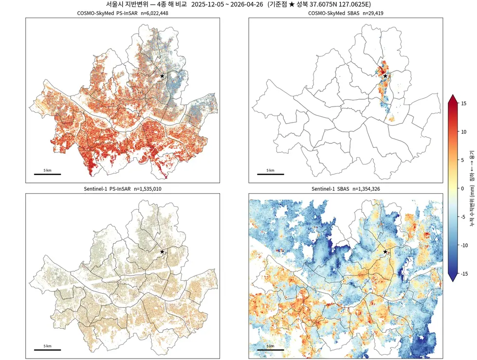

# sar/cosmo-skymed/insar/psinsar

X-band PS-InSAR 체인.

## 결과 예시

이 폴더 코드로 만든 산출물입니다. 데이터는 저장소에 없고 그림만 참고용으로 둡니다.

*서울 X-band PS-InSAR*

*산출물 4종 비교*

## 코드

| 파일 | 역할 | 입력 | 출력 |
|---|---|---|---|
| `chain_05_07.sh` | run_05 -> run_06 -> run_07 back to back, each skipping work already done. | — | — |
| `crop_seoul.py` | Crop the coregistered stack and geometry to the Seoul bounding window. | JSON | — |
| `export_final.py` | The deliverable layer: every PS with the quantities this study can defend. | JSON · NPZ · SHP | 텍스트/로그 |
| `export_ps.py` | Export a PS result (npz) to Shapefile / GeoPackage via OGR. | NumPy | — |
| `make_ps_result.py` | Final PS product: SCLA- and SCN-corrected LOS displacement + WLS velocity. | NumPy | — |
| `psi_env.sh` | Environment for the StaMPS-Python (isce2psi) pipeline. | — | — |
| `run_extract_cands.sh` | Per-patch candidate extraction (selpsc -> lonlat -> hgt -> phase), N patches in parallel. Equivalent to mt_ext | — | — |
| `run_make_sm_stack.sh` | StaMPS 입력용 단일 마스터 스택 생성 실행 | — | — |
| `run_mt_prep.sh` | StaMPS mt_prep 전처리 실행 (패치 분할) | — | — |
| `run_stamps.sh` | StaMPS steps, run from INSAR_20260420. Sequential over patches (stamps.py already loops), bounded fork workers | — | — |
| `run_step.sh` | Execute one stripmapStack run_file with a hard memory cap and bounded parallelism. run_step.sh <run_file> [JOB | — | — |

## 주요 인자

- `export_ps.py` — `--coh-min` `--fmt` `--max-pts` `--with-ts`
