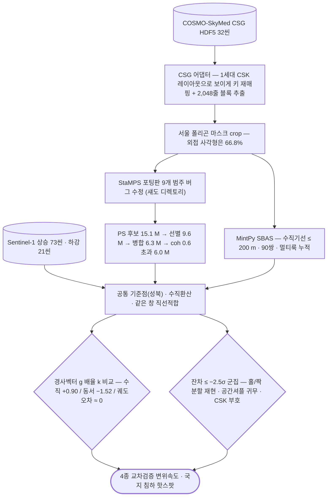

# sar/cosmo-skymed/insar/psinsar

X-band PS-InSAR 체인.

## 처리 흐름



> - 원통: 입력 자료 · 사각형: 처리 단계 · 마름모: 판정·검증 · 양끝 둥근 사각형: 산출물
> - GitHub 에서 자동 렌더링됨

---

## 코드

| 파일 | 역할 | 입력 | 출력 |
|---|---|---|---|
| `chain_05_07.sh` | run_05 -> run_06 -> run_07 back to back, each skipping work already done. | — | — |
| `crop_seoul.py` | Crop the coregistered stack and geometry to the Seoul bounding window. | JSON | — |
| `export_final.py` | The deliverable layer: every PS with the quantities this study can defend. | JSON · NPZ · SHP | 텍스트/로그 |
| `export_ps.py` | Export a PS result (npz) to Shapefile / GeoPackage via OGR. | NumPy | — |
| `make_ps_result.py` | Final PS product: SCLA- and SCN-corrected LOS displacement + WLS velocity. | NumPy | — |
| `psi_env.sh` | Environment for the StaMPS-Python (isce2psi) pipeline. | — | — |
| `run_extract_cands.sh` | Per-patch candidate extraction (selpsc -> lonlat -> hgt -> phase), N patches in parallel. Equivalent to mt_ext | — | — |
| `run_make_sm_stack.sh` | StaMPS 입력용 단일 마스터 스택 생성 실행 | — | — |
| `run_mt_prep.sh` | StaMPS mt_prep 전처리 실행 (패치 분할) | — | — |
| `run_stamps.sh` | StaMPS steps, run from INSAR_20260420. Sequential over patches (stamps.py already loops), bounded fork workers | — | — |
| `run_step.sh` | Execute one stripmapStack run_file with a hard memory cap and bounded parallelism. run_step.sh <run_file> [JOB | — | — |

## 주요 인자

- `export_ps.py` — `--coh-min` `--fmt` `--max-pts` `--with-ts`

---

## 실행

> 새 영상·새 자료가 들어왔을 때 이 모듈만으로 결과까지 가는 순서임.
> 아래 인자와 상수는 코드에서 그대로 뽑은 것임.

### 환경

```bash
conda activate isce2_snaphu      # ISCE2 · snaphu
```

- 환경 정의: [`environment/`](../../../../environment/)

### 환경변수

| 이름 | 설명 |
|---|---|
| `COH_THRESH` | 결맞음 임계값 |

### 진입점

```bash
python export_ps.py 
```
Export a PS result (npz) to Shapefile / GeoPackage via OGR. geopandas is not in this env and the `insar` env has a broken pyproj, so write with osgeo.

| 인자 | 필수 | 기본값 | 설명 |
|---|---|---|---|
| `npz` |  |  |  |
| `out_base` |  |  |  |
| `--fmt` |  | `both` |  |
| `--coh-min` |  |  |  |
| `--max-pts` |  |  |  |
| `--with-ts` |  |  |  |

- 명령줄 인자가 없는 스크립트 — 파일 안의 입력 경로를 확인한 뒤 실행함: `crop_seoul.py`, `export_final.py`
