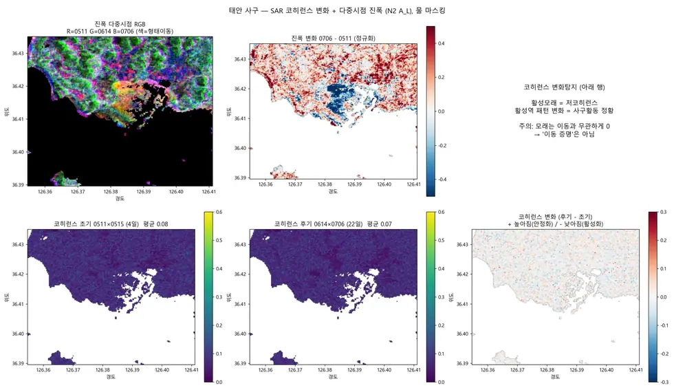

# sar/nextsat-2/change-detection

N2 진폭변화탐지(ACD) — 세 기법 중 유일하게 구조가 남는 관측.

## 결과 예시

이 폴더 코드로 만든 산출물입니다. 데이터는 저장소에 없고 그림만 참고용으로 둡니다.

*진폭변화탐지 로그비 (dB) — 세 기법 중 유일하게 구조가 남는다*

## 코드

| 파일 | 역할 | 입력 | 출력 |
|---|---|---|---|
| `acd_pair.py` | N2 ACD 진폭 로그비 0515->0614 (InSAR/OT와 동일 쌍). SSC 진폭, 동일 멀티룩·지오코딩. | GeoTIFF | GeoTIFF · 텍스트/로그 |
| `acd_right_look.py` | N2 A_R ACD: 진폭 지오코딩(0402,0529,0613) + 로그비(0402->0613, 0529->0613). SSC, 동일 처리. | GeoTIFF | GeoTIFF · 텍스트/로그 |
