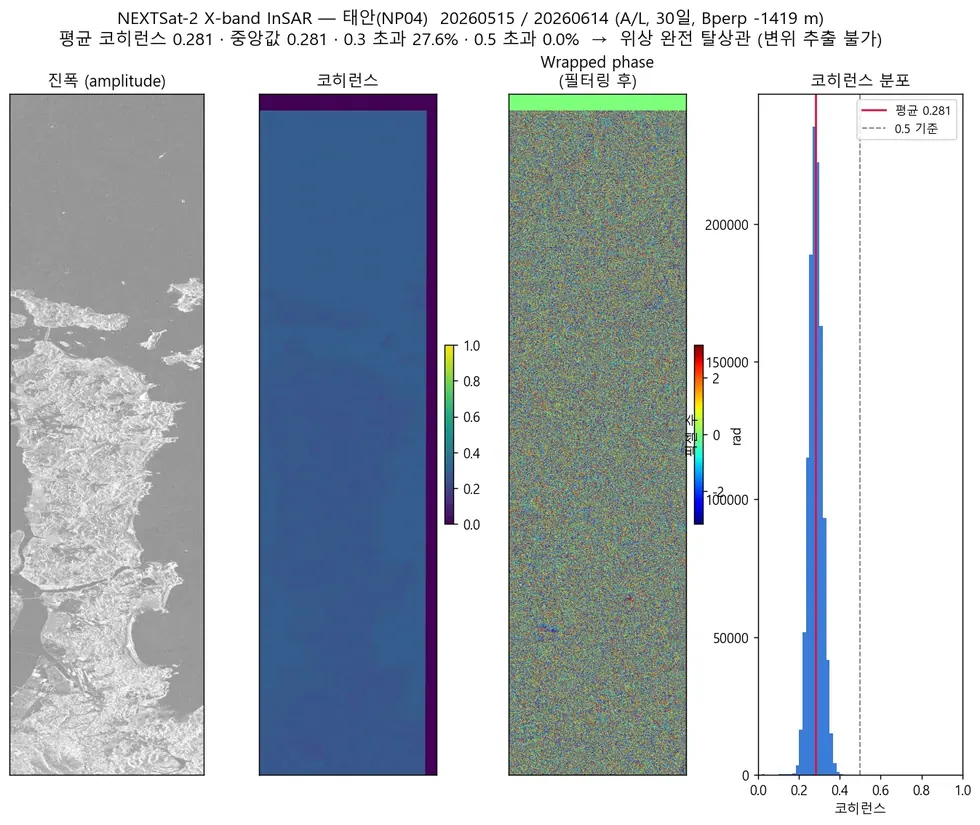

# sar/nextsat-2/insar

N2 자체 파이썬 간섭처리 (ISCE2 비의존 경로).

## 결과 예시

이 폴더 코드로 만든 산출물입니다. 데이터는 저장소에 없고 그림만 참고용으로 둡니다.

*유일하게 조건을 통과한 페어 — 평균 코히런스 0.281, 0.5 초과 0.0%*

## 코드

| 파일 | 역할 | 입력 | 출력 |
|---|---|---|---|
| `n2insar.py` | n2insar.py — NEXTSat-2 (X-band) 직접 InSAR 처리 모듈 (ISCE2 스푸핑 미사용) | GeoTIFF · HDF5 | — |
| `run_insar.py` | 개선 자작 파이프라인: 기하코레지 + 코히런스기반 방위/거리 정밀정합(ESD-lite) | GeoTIFF · HDF5 | GeoTIFF · PNG 그림 · JSON · 텍스트/로그 |
