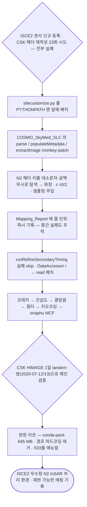

# sar/nextsat-2/isce2-spoofing

ISCE2를 고치지 않고 COSMO-SkyMed 리더를 **런타임 패치**해 N2를 처리함.

## 처리 흐름



> - 원통: 입력 자료 · 사각형: 처리 단계 · 마름모: 판정·검증 · 양끝 둥근 사각형: 산출물
> - GitHub 에서 자동 렌더링됨

---

## 하위

| 디렉터리 | 내용 |
|---|---|
| [`verify/`](verify/) | 주입한 메타데이터를 독립 기하로 재계산해 검증함. |

## 코드

| 파일 | 역할 | 입력 | 출력 |
|---|---|---|---|
| `csk_main.py` | main_csk.py — CSK InSAR 구조화 실행 스크립트 isce2_snaphu_환경에서_언래핑까지_한번에_성공.txt를 Python으로 구조화 실행: conda activate isce2_ | 파일 묶음 | 텍스트/로그 |
| `csk_viz.py` | csk_viz_csk.py — CSK InSAR 결과 시각화 모듈 bash 스크립트(isce2_snaphu_환경에서_언래핑까지_한번에_성공.txt)의 export 단계를 Python 모듈로 구조화한 | GeoTIFF · 파일 묶음 | GeoTIFF · PNG 그림 · 텍스트/로그 |
| `doppler_h5.py` | N2/CSK HDF5에서 도플러 중심주파수 추출 | HDF5 | — |
| `fix_sbi_layout.py` | 구형 SBI 레이아웃 HDF5를 (L,C,2) int16 형식으로 재작성 — 반드시 사본에 적용 | HDF5 | — |
| `n2_main.py` | n2_main.py 이식(portable) 버전 — 하드코딩 경로 제거 원본 n2_main.py는 사내 절대경로 3개가 하드코딩돼 있어 다른 PC에서 그대로 안 돔. | XML | 텍스트/로그 |
| `n2_patch.py` | ISCE2 COSMO_SkyMed_SLC 리더를 런타임 몽키패치해 N2 헤더를 주입하는 핵심 모듈 | HDF5 | 텍스트/로그 |
| `n2_to_csk.py` | --- 물리 상수 --- | HDF5 | — |
| `n2_viz.py` | N2 처리 결과(진폭·간섭도·코히런스) 시각화 | GeoTIFF · 파일 묶음 | PNG 그림 |
| `read_n2_meta.py` | N2 HDF5 메타데이터를 사람이 읽을 형태로 덤프 | HDF5 | — |
| `run_np04.py` | NP04 runner — n2_main_portable.py 와 동일 로직, 단 /mnt/c(DrvFs)에서 chmod 실패를 피하려고 shutil.copy -> shutil.copyfile 로 교 | XML | 텍스트/로그 |

---

## 실행

> 새 영상·새 자료가 들어왔을 때 이 모듈만으로 결과까지 가는 순서임.
> 아래 인자와 상수는 코드에서 그대로 뽑은 것임.

### 환경

```bash
conda activate pyps      # geopandas · rasterio
```

- 환경 정의: [`environment/`](../../../environment/)

### 환경변수

| 이름 | 설명 |
|---|---|
| `CSK_DEM` | 코드 참조 |
| `CSK_OUT` | 코드 참조 |
| `CSK_ROOT` | 코드 참조 |
| `N2_ROOT` | 코드 참조 |
| `N2_XML` | 코드 참조 |
| `SNAPHU_BIN` | snaphu 실행 파일 경로 |

- 명령줄 인자가 없는 스크립트 — 파일 안의 입력 경로를 확인한 뒤 실행함: `csk_main.py`, `fix_sbi_layout.py`, `n2_main.py`, `n2_to_csk.py`, `run_np04.py`
