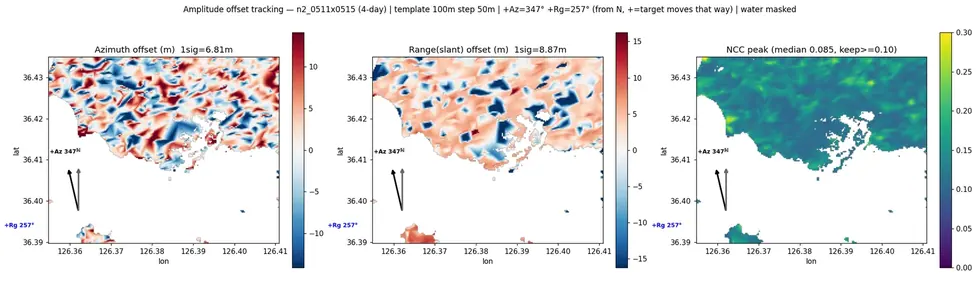

# sar/nextsat-2/offset-tracking

NCC 정합 + 부화소 피크 추정. N2·S1 양쪽에 쓴다.

## 결과 예시

이 폴더 코드로 만든 산출물입니다. 데이터는 저장소에 없고 그림만 참고용으로 둡니다.

*오프셋 트래킹 — 방위·거리 이동량과 상관 품질*

## 코드

| 파일 | 역할 | 입력 | 출력 |
|---|---|---|---|
| `ncc_vs_time.py` | 모든 오프셋 트래킹 쌍의 NCC 중앙값 vs 시간차 — 탈상관 진단 종합 그래프. | JSON | PNG 그림 |
| `offset_track.py` | 진폭 오프셋 트래킹 (사구) — 모드 선택형 + 지상footprint 기준 사각 템플릿 + 방향 화살표. | GeoTIFF | GeoTIFF · PNG 그림 · 텍스트/로그 |
