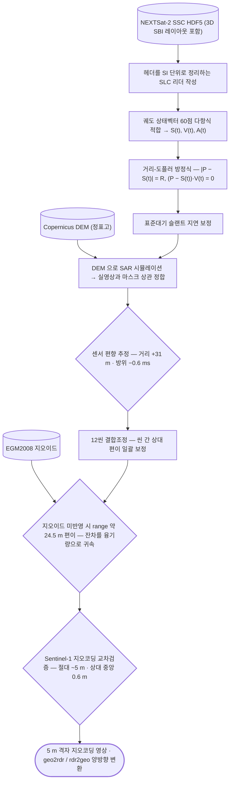

# sar/nextsat-2/sensor-model

거리-도플러 **엄밀센서모델**을 처음부터 구현해 지오코딩함. `step01`~`step13` 번호가 처리 순서.

## 처리 흐름

> - 원통: 입력 자료 · 사각형: 처리 단계 · 마름모: 판정·검증 · 양끝 둥근 사각형: 산출물
> - GitHub 에서 자동 렌더링됨

---

## 하위

| 디렉터리 | 내용 |
|---|---|
| [`lib/`](lib/) | 센서모델 라이브러리 — 읽기·궤도·기하·대기·지형·시뮬레이션. |

## 코드

| 파일 | 역할 | 입력 | 출력 |
|---|---|---|---|
| `step01_grid_orbit.py` | Step 1~2 실행: 한 씬을 읽어 격자와 궤도를 세우고 체크포인트를 출력함. | H5 | — |
| `step02_geometry.py` | Step 3~6 실행: geo2rdr / rdr2geo 를 세우고 자기일관성·룰사이드·풋프린트를 검증함. | GEOJSON · H5 | — |
| `step03_bias_dem.py` | Step 7 실행: 대류권 보정 + DEM 지형 시뮬레이션 정합으로 편향(Δt_az, ΔR) 추정. | NumPy | PNG 그림 · NumPy |
| `step04_geocode.py` | Step 9 실행: 역방향(backward) 지오코딩 → GeoTIFF (UTM 52N). | GeoTIFF · NumPy · JSON | GeoTIFF · PNG 그림 · NumPy · 텍스트/로그 |
| `step05_clip_rect.py` | Step 9b: 지오코딩 결과를 '스트립 정렬 직사각형' 으로 클립 — 광학 정사영상처럼 반듯한 마름모 산출물. | GeoTIFF | GeoTIFF · PNG 그림 · 텍스트/로그 |
| `step06_s1_reference.py` | Step 10 보조: 같은 위치의 Sentinel-1 RTC(지형보정 γ0) 를 받아 N2 격자에 올리고, 위치 잔차를 교차검증함. | GeoTIFF | GeoTIFF · PNG 그림 · 텍스트/로그 |
| `step07_lsq.py` | Step 7-LS: 창(타이포인트) 단위 다중 정합 → 강건 최소제곱으로 편향 모수와 표준오차 추정. | JSON | PNG 그림 |
| `step08_all_scenes.py` | Step 8: 한라산 12씬 전부 step07(창 LS) 실행 → 4모수 결합 최소제곱으로 센서 상수와 DEM 지상오프셋 분리. | JSON · 파일 묶음 | PNG 그림 · JSON |
| `step09_stack.py` | Step 9: 백록담 시계열 스택 — 12씬 5 m AOI 지오코딩(씬별 편향) → 그룹별 상대정합 검증 → 스택 GeoTIFF. | GeoTIFF · 파일 묶음 | GeoTIFF · PNG 그림 · 텍스트/로그 |
| `step10_fine_coreg.py` | Step 10: 그룹 내 미세정합 — 씬 쌍 시프트(step09 coreg_check.csv) 를 네트워크 최소제곱으로 풀어 | GeoTIFF | GeoTIFF · 텍스트/로그 |
| `step11_water_detect.py` | Step 11: 백록담 수체 탐지 — 미세정합 스택(step10) 기반. | GeoTIFF · 파일 묶음 | PNG 그림 · 텍스트/로그 |
| `step12_compare_3col.py` | Step 12: N2 / Sentinel-1 / Sentinel-2 3열 비교 PNG (최신 기하보정본 기준). | GeoTIFF · 파일 묶음 | PNG 그림 |
| `step13_water_panel.py` | Step 13: 백록담 수체 판독용 4열 패널 (가독성 개선판). | GeoTIFF · 파일 묶음 | PNG 그림 |

## 주요 인자

- `step11_water_detect.py` — `--indir` `--outdir` `--scenes`
