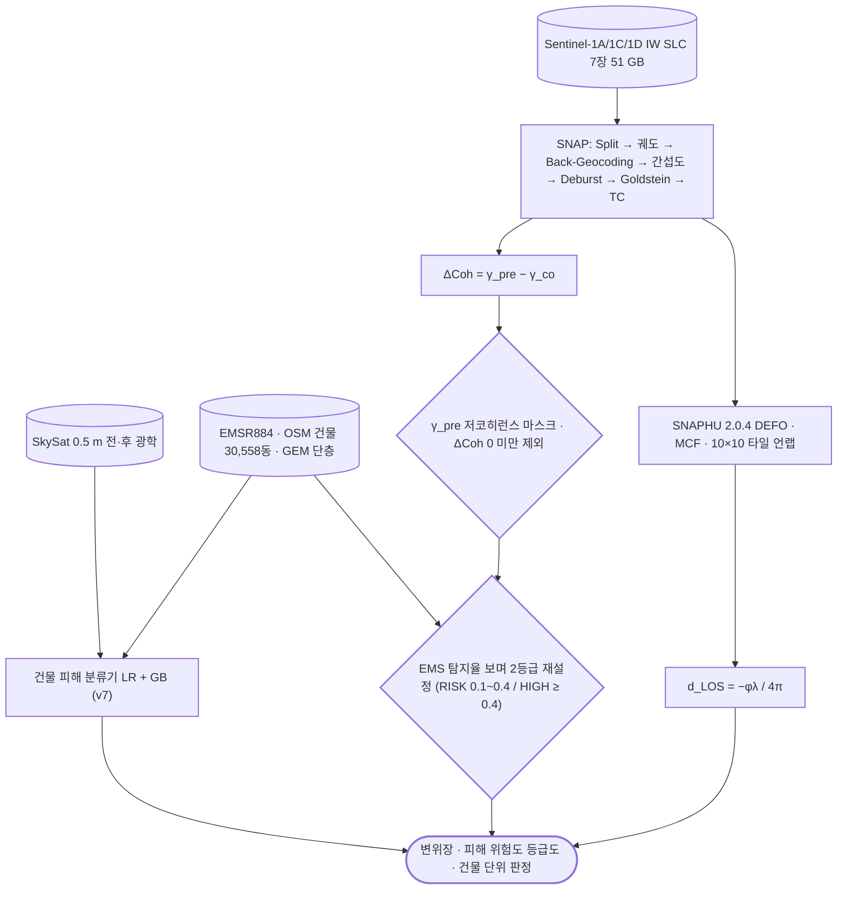

# sar/sentinel-1/change-detection

**변화탐지.** 위상이 아니라 코히런스·진폭의 변화를 본다 — 탈상관이 심한 곳에서도 동작함.

## 처리 흐름

> - 원통: 입력 자료 · 사각형: 처리 단계 · 마름모: 판정·검증 · 양끝 둥근 사각형: 산출물
> - GitHub 에서 자동 렌더링됨

---

## 하위

| 디렉터리 | 내용 |
|---|---|
| [`amplitude/`](amplitude/) | **ACD** — 진폭 로그비로 변화를 봄. 코히런스가 아예 없을 때의 대안. |
| [`coherence/`](coherence/) | **CCD** — 사건 전후 코히런스 저하로 피해를 가림. 건물 붕괴·침수처럼 산란 구조가 바뀌는 변화에 민감. |

## 코드

| 파일 | 역할 | 입력 | 출력 |
|---|---|---|---|
| `coh_amp_change.py` | 사구 변화 — 코히런스 변화탐지 + 진폭 다중시점 (N2 A_L). OT와 다른 기법 → taean_CCD. | GeoTIFF | GeoTIFF · PNG 그림 · 텍스트/로그 |
