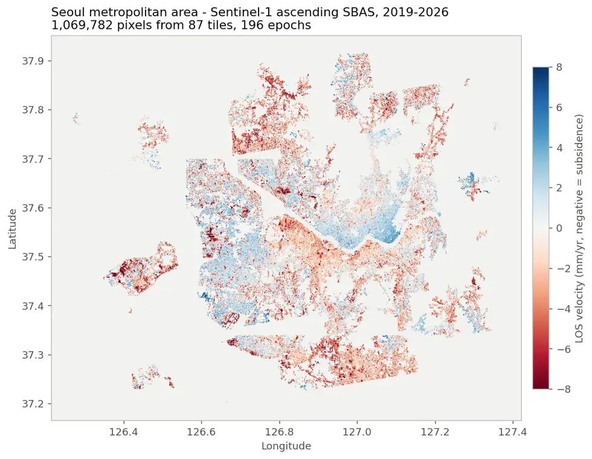
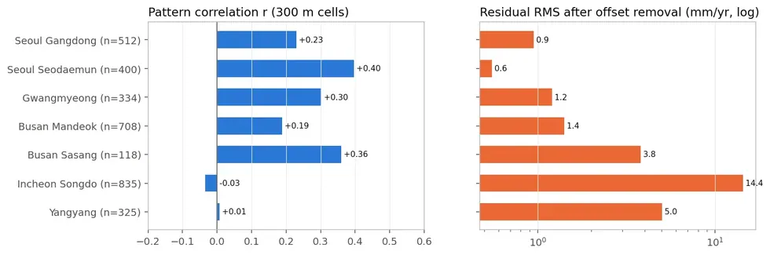

# sar/sentinel-1/insar

간섭측량. 아래 기법별 폴더로 나뉘며, 입력은 모두 코레지된 SLC 스택이다.

## 하위

| 디렉터리 | 내용 |
|---|---|
| [`decomposition/`](decomposition/) | 상승·하강 LOS 속도를 **수직·동서 성분**으로 분해하고 두 기법을 비교한다. |
| [`dinsar/`](dinsar/) | **DInSAR** — 두 시기 간섭쌍 하나로 변위를 본다. 지진처럼 단발 큰 변위에 쓴다. |
| [`psinsar/`](psinsar/) | **PS-InSAR** — 시간에 걸쳐 안정한 점(영구산란체)만 골라 변위를 잰다. 도심·구조물에 유리. |
| [`sbas/`](sbas/) | **SBAS** — 짧은 베이스라인 간섭쌍 다수를 역산해 변위 시계열을 만든다. 분산 산란체에 유리. |
| [`viz/`](viz/) | 변위 결과 시각화. |

## 결과 예시

이 폴더 코드로 만든 산출물입니다. 데이터는 저장소에 없고 그림만 참고용으로 둡니다.

*수도권 광역 SBAS — 106만 픽셀*

*PS vs SBAS 교차 비교 — 도심 저변형 지역은 약 1 mm/yr 안에서 일치*

## 코드

| 파일 | 역할 | 입력 | 출력 |
|---|---|---|---|
| `compare_ps_sbas.py` | PS vs SBAS 비교분석: 공통 격자(300m) 집계 → 공통모드 제거 → 패턴 상관 + 4패널 비교도(지역별 PNG) + 요약 | shp/GeoJSON | PNG 그림 · 텍스트/로그 |
