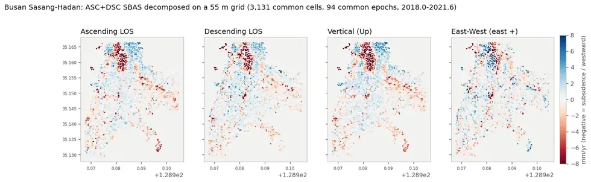

# sar/sentinel-1/insar/decomposition

상승·하강 LOS 속도를 **수직·동서 성분**으로 분해하고 두 기법을 비교한다.

## 결과 예시

이 폴더 코드로 만든 산출물입니다. 데이터는 저장소에 없고 그림만 참고용으로 둡니다.

*상승·하강 LOS → 수직·동서 성분 분해*

## 코드

| 파일 | 역할 | 입력 | 출력 |
|---|---|---|---|
| `build_decomposition.py` | ASC/DSC 중복기간 수직·동서 분해 → SBAS csv 4종 생성. usage: decomp_build.py [지역...] | JSON | CSV · JSON |
| `compare_all.py` | Four-way comparison: CSK PS / CSK SBAS / S1 PS / S1 SBAS. | HDF5 · NumPy | — |
| `compare_diag.py` | Two diagnostics that turn the correlation table into a conclusion. | HDF5 | — |
| `compare_run.py` | Run the four-way comparison and write results/compare/summary.json. | HDF5 | — |
| `decomp_csk_dsc.py` | CSK(상승·X밴드) + S1 DSC(하강·C밴드) 로 봄→여름 창을 수직/동서 분해한다. | HDF5 · NumPy | — |
| `decompose_asc_dsc.py` | 상승/하강 궤도 LOS 를 수직 + 동서 성분으로 분해하고, 남북 경사의 정체를 판정한다. | HDF5 | — |
| `gu_stats.py` | Per-자치구 summary of the four products. | HDF5 · JSON | — |
| `make_maps.py` | Seoul subsidence maps for the four products. | HDF5 · JSON | PNG 그림 |
| `season_test.py` | Does S1 reproduce the CSK number when given the same months? | HDF5 | — |
| `tilt_verdict.py` | 서울 지도에 남은 도시 규모 경사의 정체를 판정하고 그림으로 낸다. | HDF5 · NumPy · JSON | PNG 그림 |
| `validate_ramp.py` | Is the NE-SW gradient in the S1 secular map ground motion or a residual ramp? | 파일 묶음 | — |
| `validate_ramp2.py` | Second pass on the NE-SW tilt, after GNSS coverage turned out to be the limit. | 파일 묶음 | — |

## 주요 인자

- `decomp_csk_dsc.py` — `--cell` `--t0` `--t1`
- `decompose_asc_dsc.py` — `--t0` `--t1`
