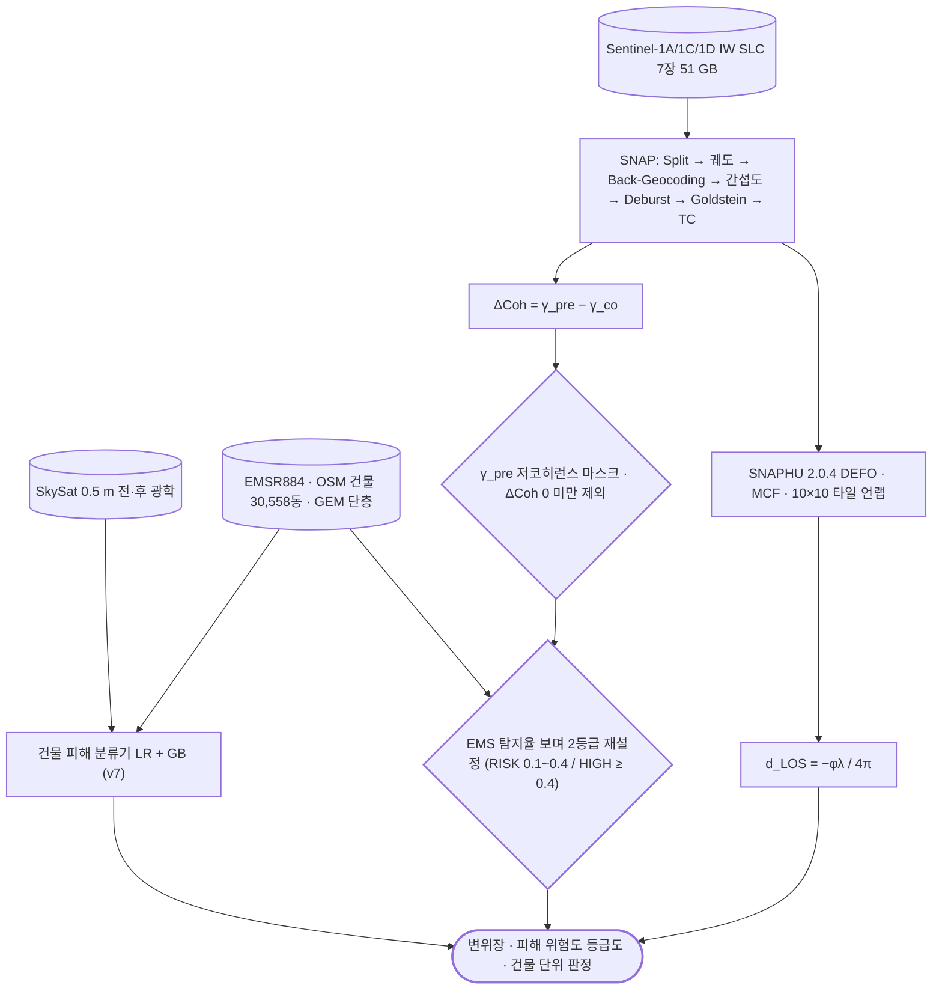

# sar/sentinel-1/insar/dinsar

**DInSAR** — 두 시기 간섭쌍 하나로 변위를 봄. 지진처럼 단발 큰 변위에 씀.

## 처리 흐름



> - 원통: 입력 자료 · 사각형: 처리 단계 · 마름모: 판정·검증 · 양끝 둥근 사각형: 산출물
> - GitHub 에서 자동 렌더링됨

<!-- crosslink -->
### 이 기법을 쓴 사례

- 여기 코드는 어느 자료에도 쓸 수 있는 처리임. 아래는 실제로 적용한 사건별 분석임

| 사례 | 내용 |
|---|---|
| [`applications/disaster-damage/earthquake/`](../../../../applications/disaster-damage/earthquake/) | 베네수엘라 M7.5 — 건물 단위 피해 등급과 GIS 교차검증 |
| [`applications/dem-generation/`](../../../../applications/dem-generation/) | 중남미 고해상도 DTM 제작 |
<!-- crosslink -->

---

## 코드

| 파일 | 역할 | 입력 | 출력 |
|---|---|---|---|
| `coreg_interferogram.py` | Stage 3: 코레지스트레이션 + 간섭도 + flat/topo 기준위상. | JSON | PNG 그림 · NumPy |
| `run_s1_insar.py` | Sentinel-1 IW(TOPS) InSAR — 0531(S1C)x0613(S1D), iw1 burst0, 남부 태안 AOI. | GeoTIFF | GeoTIFF · PNG 그림 · 텍스트/로그 |
| `s1insar.py` | s1insar.py — Sentinel-1 IW(TOPS) InSAR 리더/기하 (n2insar 흐름 재사용). | GeoTIFF | — |
| `unw_to_displacement.py` | ISCE2 언랩 결과(filt_topophase.unw.geo, band2=위상)를 LOS 변위로 변환해 GeoTIFF 산출. | GeoTIFF | GeoTIFF · PNG 그림 · 텍스트/로그 |

---

## 실행

> 새 영상·새 자료가 들어왔을 때 이 모듈만으로 결과까지 가는 순서임.
> 아래 인자와 상수는 코드에서 그대로 뽑은 것임.

### 환경

```bash
conda activate pyps      # geopandas · rasterio
```

- 환경 정의: [`environment/`](../../../../environment/)
