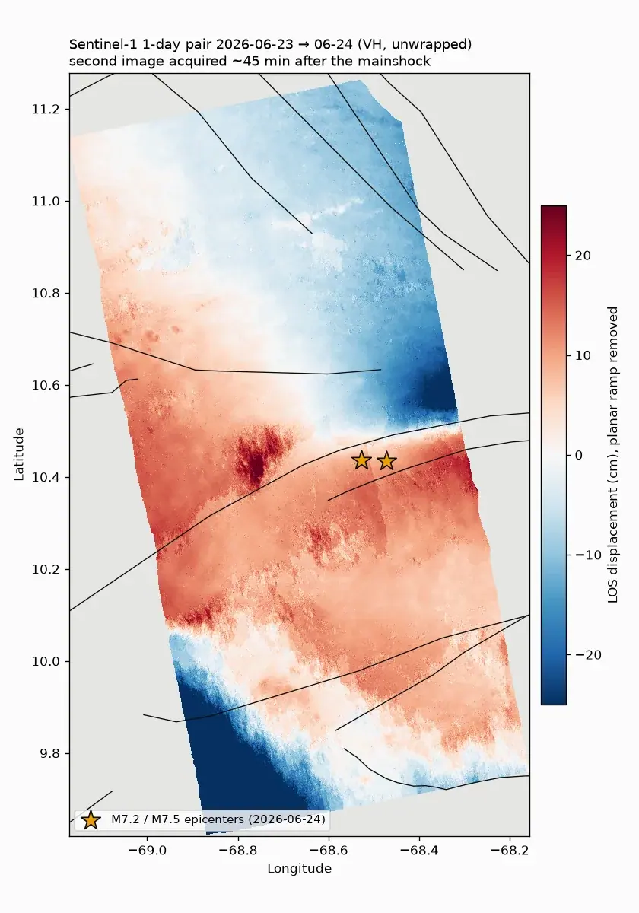
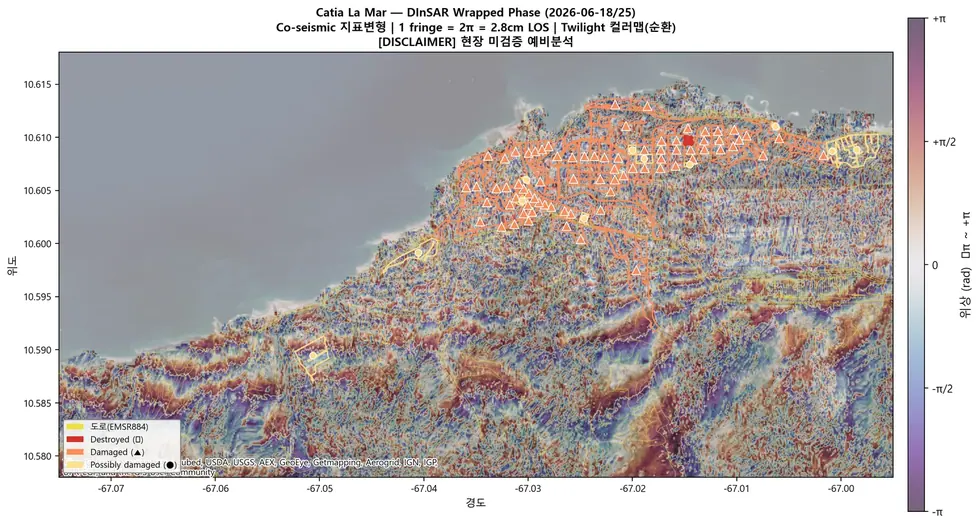

# sar/sentinel-1/insar/dinsar

**DInSAR** — 두 시기 간섭쌍 하나로 변위를 본다. 지진처럼 단발 큰 변위에 쓴다.

## 결과 예시

이 폴더 코드로 만든 산출물입니다. 데이터는 저장소에 없고 그림만 참고용으로 둡니다.

*지진 직후 1일 간격 DInSAR — 진앙 주변 변위*

*래핑 위상 — 프린지가 변위량을 나타낸다*

## 코드

| 파일 | 역할 | 입력 | 출력 |
|---|---|---|---|
| `coreg_interferogram.py` | Stage 3: 코레지스트레이션 + 간섭도 + flat/topo 기준위상. | JSON | PNG 그림 · NumPy |
| `run_s1_insar.py` | Sentinel-1 IW(TOPS) InSAR — 0531(S1C)x0613(S1D), iw1 burst0, 남부 태안 AOI. | GeoTIFF | GeoTIFF · PNG 그림 · 텍스트/로그 |
| `s1insar.py` | s1insar.py — Sentinel-1 IW(TOPS) InSAR 리더/기하 (n2insar 흐름 재사용). | GeoTIFF | — |
| `unw_to_displacement.py` | ISCE2 언랩 결과(filt_topophase.unw.geo, band2=위상)를 LOS 변위로 변환해 GeoTIFF 산출. | GeoTIFF | GeoTIFF · PNG 그림 · 텍스트/로그 |
