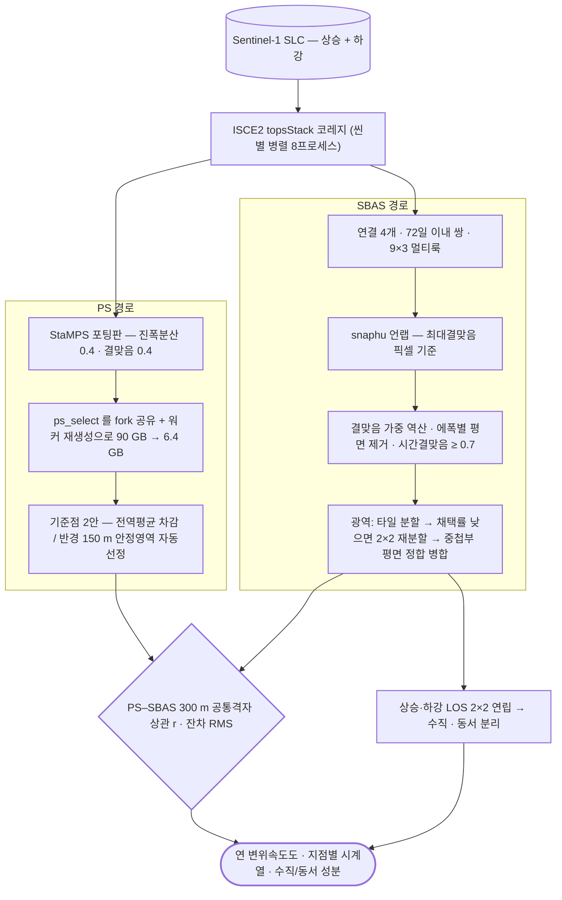

# sar/sentinel-1/insar/psinsar

**PS-InSAR** — 시간에 걸쳐 안정한 점(영구산란체)만 골라 변위를 잼. 도심·구조물에 유리.

## 처리 흐름

> - 원통: 입력 자료 · 사각형: 처리 단계 · 마름모: 판정·검증 · 양끝 둥근 사각형: 산출물
> - GitHub 에서 자동 렌더링됨

---

## 하위

| 디렉터리 | 내용 |
|---|---|
| [`ascending/`](ascending/) | 상승궤도 PS 처리 체인. |
| [`descending/`](descending/) | 하강궤도 PS 처리 체인. |
| [`stamps_patches/`](stamps_patches/) | StaMPS 파이썬 포팅본에 적용한 패치 — 업스트림 원본은 포함하지 않음. |

## 코드

| 파일 | 역할 | 입력 | 출력 |
|---|---|---|---|
| `env.sh` | PS-InSAR 세션 환경 (일반화본). ISCE2 + StaMPS Python 포팅(psi_python) 경로는 설치 환경에 맞게 지정. 사용: source env_seoul.sh | — | — |
| `process_region.sh` | 일반화 지역 처리: PS(차감전/후/raw + 클릭맵2) + SBAS(차감전/후 + 클릭맵2) → CLAB/{REGION}/{PS,SBAS} usage: process_region.sh REGION | shp/GeoJSON · JSON | — |
| `ps_extract.py` | PS 후보 추출 → LOS 속도·시계열 산출 | shp/GeoJSON | CSV |
| `stamps_mp_patch.py` | 런처용 monkeypatch: ps_select(step3)의 OOM 폭증을 막는 '스마트 Pool'. | — | — |
