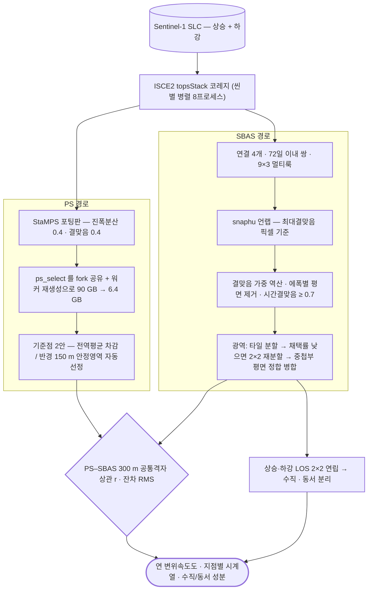

# sar/sentinel-1/insar/sbas

**SBAS** — 짧은 베이스라인 간섭쌍 다수를 역산해 변위 시계열을 만듦. 분산 산란체에 유리.

## 처리 흐름

> - 원통: 입력 자료 · 사각형: 처리 단계 · 마름모: 판정·검증 · 양끝 둥근 사각형: 산출물
> - GitHub 에서 자동 렌더링됨

---

## 하위

| 디렉터리 | 내용 |
|---|---|
| [`mintpy/`](mintpy/) | MintPy 기반 SBAS 파이프라인 (대기보정 포함). |
| [`wide-area/`](wide-area/) | 광역 처리를 위한 타일 분할·병합. 메모리 한계를 타일링으로 우회함. |

## 코드

| 파일 | 역할 | 입력 | 출력 |
|---|---|---|---|
| `export_sbas.py` | Geocoded SBAS grids -> GeoTIFF (+ point shapefile of the valid cells). | HDF5 | — |
| `fix_rsc_looks.py` | 멀티룩한 파일의 .rsc 를 실제 룩 수에 맞게 고침. | 파일 묶음 | 텍스트/로그 |
| `pygmtsar_gyeongju.py` | PyGMTSAR SBAS+PS — 경주 태풍 산사태 지역 변위 시계열 | NC · PNG · TIF | PNG 그림 |
| `pygmtsar_karakoram.py` | PyGMTSAR SBAS+PS — 카라코람 사면 변위 시계열 | NC · PNG · TIF | PNG 그림 |
| `pygmtsar_sbas.py` | PyGMTSAR SBAS 범용 드라이버 (다운로드 → 간섭도 → 역산 → 속도) | NC · PNG · TIF | PNG 그림 |
| `run_mintpy.sh` | MintPy SBAS 실행 래퍼 | TXT | — |
| `run_sbas_autoscale.py` | 일반화 정밀 SBAS (MintPy식) — run_sbas.py 패치판. 차이점: merged geom(lat/lon.rdr)↔SLC.full 배율을 자동감지(mrg,maz)하여 | GeoTIFF · NumPy · 파일 묶음 | CSV · shp/GeoJSON · NumPy · 텍스트/로그 |
| `run_sbas_descending.sh` | DSC SBAS 실행 (지역별 순차). usage: run_sbas_dsc.sh <t061/t134> 하강궤도는 geom 이 full-res(1x1) 이므로 run_sbas_autoscale.py( | CSV | — |
| `run_sbas_igrams.sh` | SBAS pair processing: multilooked ifg -> Goldstein filter + coherence -> snaphu. Resumable: a pair whose .unw  | TXT · VRT · XML | — |
| `run_sbas_igrams_new.sh` | SBAS pair processing: multilooked ifg -> Goldstein filter + coherence -> snaphu. Resumable: a pair whose .unw  | TXT · VRT · XML | — |
| `sbas_lib.py` | SBAS helpers: multilooked interferograms and geometry from the Seoul crop. | JSON | — |

## 주요 인자

- `export_sbas.py` — `--geo` `--out` `--tag` `--tc-min` `--ts`
- `run_sbas_autoscale.py` — `--azl` `--bbox` `--cmax` `--coh_min` `--lam` `--merged` `--out` `--region` `--rgl` `--tcoh_min` `--tmax`
