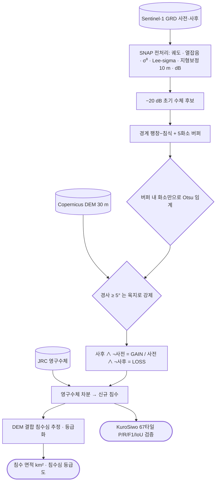

# sar/sentinel-1/water/flood

**홍수 탐지.** Edge-Otsu 자동 임계값으로 수체를 분리하고 전후 차분으로 침수역을 냄.

## 처리 흐름



> - 원통: 입력 자료 · 사각형: 처리 단계 · 마름모: 판정·검증 · 양끝 둥근 사각형: 산출물
> - GitHub 에서 자동 렌더링됨

<!-- crosslink -->
### 이 기법을 쓴 사례

- 여기 코드는 어느 자료에도 쓸 수 있는 처리임. 아래는 실제로 적용한 사건별 분석임

| 사례 | 내용 |
|---|---|
| [`applications/disaster-damage/flood/`](../../../../applications/disaster-damage/flood/) | 네팔 라수와 빙하붕괴 돌발홍수 — 하천 회랑 피해범위와 노출 집계 |
| [`applications/rail-hazard/`](../../../../applications/rail-hazard/) | 일본 철도 재해 탐지 타당성 |
<!-- crosslink -->

---

## 하위

| 디렉터리 | 내용 |
|---|---|
| [`notebooks/`](notebooks/) | 임계값 전략 비교·결과 검토용 노트북. |
| [`satchat/`](satchat/) | 서비스 모듈판 — SNAP 비의존(전처리된 dB GeoTIFF 입력) + KuroSiwo 벤치마크 평가. |

## 코드

| 파일 | 역할 | 입력 | 출력 |
|---|---|---|---|
| `analyse_flood_grd.py` | The actual analysis: what can free Sentinel-1 see of this disaster, measured. | GeoTIFF · JSON | GeoTIFF · JSON · 텍스트/로그 |
| `db_geocode.py` | 날짜별 후방산란(dB)을 간섭도와 같은 레이더 격자로 만들고 ISCE 메타데이터를 붙임. | GeoTIFF | 텍스트/로그 |
| `flood_detect_slc.py` | 홍수 피해구역 탐지 (강임계 + 대조군 + 군집필터) — 2026 네팔 홍수 | GeoTIFF · JSON | — |
| `flood_map.py` | 탐지 결과 지도 + 주요 군집 좌표. usage: flood_map.py <TRACK> | GeoTIFF · JSON | PNG 그림 · JSON |
| `otsu_flood.py` | Otsu 임계 기반 홍수 피해구역 분할 — 2026 네팔 홍수 | GeoTIFF · JSON | — |
| `s1_processor.py` | Sentinel-1 자동 수체 탐지 및 홍수 탐지 통합 파이프라인 파일명: s1_processor7.py (전처리 전에 인셋: 자동 NaN행 기반 트리밍) | GeoTIFF · shp/GeoJSON | GeoTIFF · shp/GeoJSON · 텍스트/로그 |
| `s1_processor_benchmark.py` | 벤치마크 평가판 — 전처리된 GeoTIFF 입력으로 수체 마스크만 산출 (Sen1Flood11/KuroSiwo) | GeoTIFF | GeoTIFF · 텍스트/로그 |
| `waterbody_mask.py` | 수체 마스크만 산출하는 경량 버전 (홍수 차분 없음) | GeoTIFF · shp/GeoJSON · 파일 묶음 | GeoTIFF · 텍스트/로그 |

## 주요 인자

- `s1_processor.py` — `--after_mask` `--aoi_shp` `--before_mask` `--dem_path` `--edge_buffer` `--flood_detection` `--flood_stats` `--initial_db_threshold` `--input_zips` `--output_dir` `--polarization` `--slope_path`
- `s1_processor_benchmark.py` — `--edge_buffer` `--initial_db_threshold` `--input_tifs` `--output_dir` `--polarization`

---

## 실행

> 새 영상·새 자료가 들어왔을 때 이 모듈만으로 결과까지 가는 순서임.
> 아래 인자와 상수는 코드에서 그대로 뽑은 것임.

### 환경

```bash
conda activate pyps      # geopandas · rasterio
```

- 환경 정의: [`environment/`](../../../../environment/)

### 환경변수

| 이름 | 설명 |
|---|---|
| `DATA_ROOT` | 원본·중간 산출물이 놓인 데이터 루트 |

### 진입점

```bash
python s1_processor.py --input_zips <값> --output_dir <값> --before_mask <값> --after_mask <값> --output_dir <값>
```

| 인자 | 필수 | 기본값 | 설명 |
|---|---|---|---|
| `--input_zips` | ● |  | 입력 S1 원본 ZIP 경로(1개 이상) |
| `--output_dir` | ● |  | 산출물 기본 폴더 |
| `--aoi_shp` |  |  | AOI Shapefile 경로(없으면 AOI 미사용) |
| `--dem_path` |  |  | 외부 DEM GeoTIFF 경로(없으면 자동 다운로드) |
| `--slope_path` |  |  | 외부 Slope GeoTIFF 경로(없으면 자동 계산) |
| `--polarization` |  | `VV` | 편파 (기본: VV) |
| `--initial_db_threshold` |  |  | Edge Otsu 초기 임계값(dB) |
| `--slope_threshold` |  | `5.0` | 경사 임계값(도) |
| `--edge_buffer` |  | `5` | Edge 감지 후 버퍼링 횟수 |
| `--flood_detection` |  | `no` | 두 시점 수체마스크로 홍수탐지 수행 여부 |
| `--flood_stats` |  | `no` | 홍수 결과 픽셀/면적 통계 로그 출력 |
| `--before_mask` | ● |  | 이전 시점 수체 마스크 경로 |
| `--after_mask` | ● |  | 이후 시점 수체 마스크 경로 |
| `--output_dir` | ● |  | 산출물 폴더(무시됨: 클래스 내부 폴더 사용) |
| `--flood_stats` |  | `no` | 픽셀/면적 통계 로그 출력 |

```bash
python s1_processor_benchmark.py --input_tifs <값> --output_dir <값>
```

| 인자 | 필수 | 기본값 | 설명 |
|---|---|---|---|
| `--input_tifs` | ● |  | 입력 dB GeoTIFF 경로 (와일드카드 지원, 예: 'D:\data\*.tif') |
| `--output_dir` | ● |  | 수체 마스크 GeoTIFF를 저장할 폴더 |
| `--polarization` |  | `VH` | 사용할 편파 (기본: VH, Sen1Floods11 S1 기준 band2) |
| `--initial_db_threshold` |  |  | Edge-Otsu 초기 임계값 (dB) |
| `--edge_buffer` |  | `5` | 경계 dilation 버퍼링 횟수 |

- 명령줄 인자가 없는 스크립트 — 파일 안의 입력 경로를 확인한 뒤 실행함: `analyse_flood_grd.py`, `db_geocode.py`, `flood_detect_slc.py`, `flood_map.py`, `otsu_flood.py`, `waterbody_mask.py`
