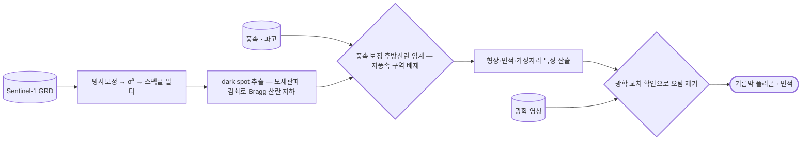

# sar/sentinel-1/water/oil-spill

기름막은 모세관파를 감쇠시켜 어둡게 보인다 — dark spot 탐지.

## 처리 흐름

> - 원통: 입력 자료 · 사각형: 처리 단계 · 마름모: 판정·검증 · 양끝 둥근 사각형: 산출물
> - GitHub 에서 자동 렌더링됨

---

## 하위

| 디렉터리 | 내용 |
|---|---|
| [`notebooks/`](notebooks/) |  |
