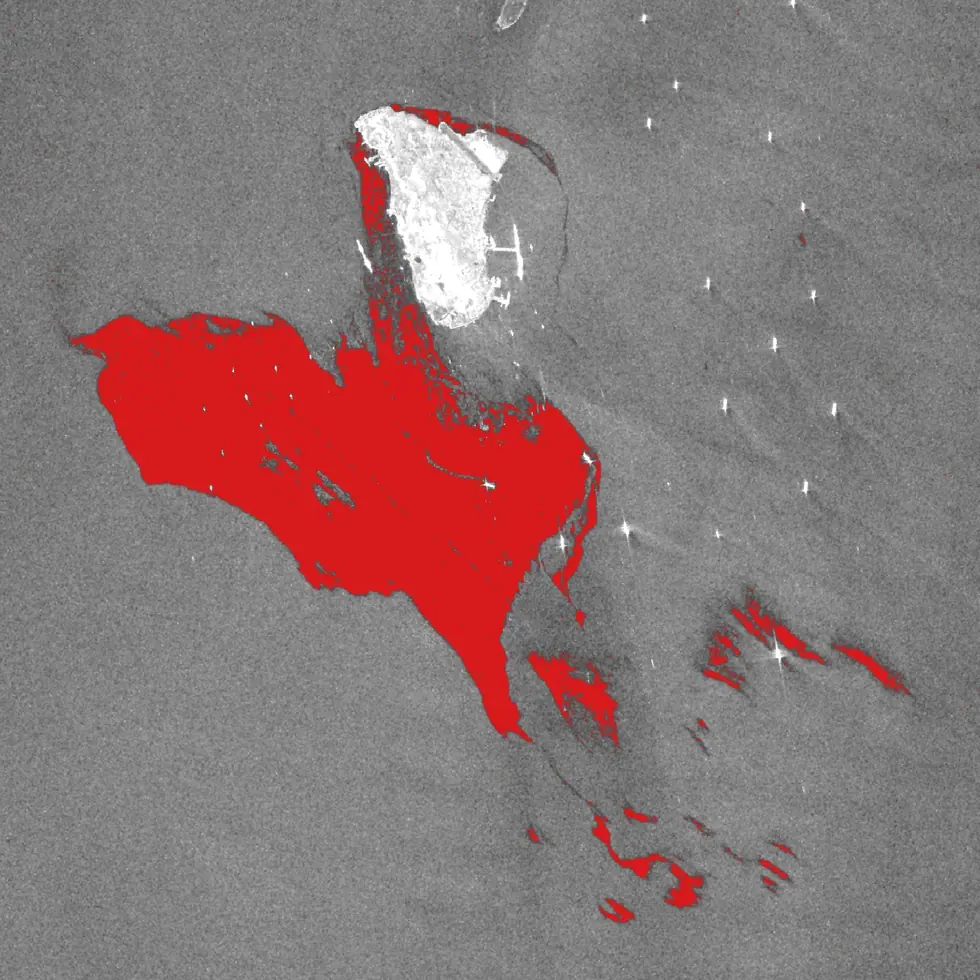
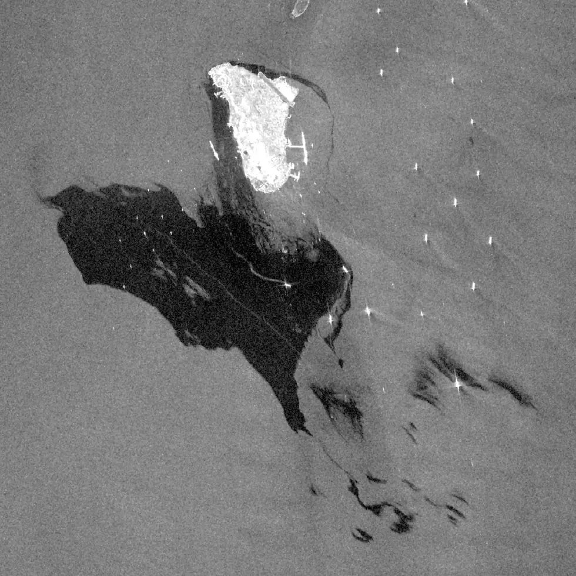

# sar/sentinel-1/water/oil-spill

기름막은 모세관파를 감쇠시켜 어둡게 보인다 — dark spot 탐지.

## 하위

| 디렉터리 | 내용 |
|---|---|
| [`notebooks/`](notebooks/) |  |

## 결과 예시

이 폴더 코드로 만든 산출물입니다. 데이터는 저장소에 없고 그림만 참고용으로 둡니다.

*기름유출 탐지 결과 (적색) — 페르시아만*

*원본 SAR — 기름막에 의한 dark spot*
