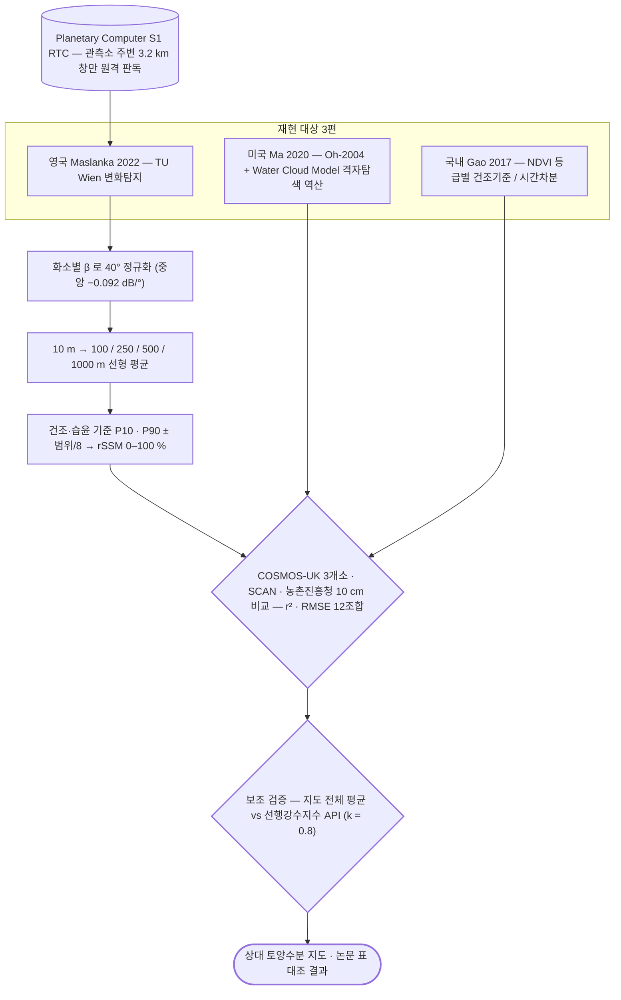

# sar/sentinel-1/water/soil-moisture

후방산란 변화로 표층 토양수분을 산출함. 논문 3편을 수정 없이 재현함.

## 처리 흐름

> - 원통: 입력 자료 · 사각형: 처리 단계 · 마름모: 판정·검증 · 양끝 둥근 사각형: 산출물
> - GitHub 에서 자동 렌더링됨

---

## 하위

| 디렉터리 | 내용 |
|---|---|
| [`korea_gao2017/`](korea_gao2017/) | Gao 2017 (S1+S2 변화탐지) — 국내 가평·화성 적용. |
| [`pinn_cho2026/`](pinn_cho2026/) | Cho 2026 PINN-WCM 재구현 시도 (동료심사 전 논문, 검증용). |
| [`uk_maslanka2022/`](uk_maslanka2022/) | Maslanka 2022 (TU Wien 변화탐지) — 영국 COSMOS-UK 재현. |
| [`us_ma2020/`](us_ma2020/) | Ma 2020 (Oh + WCM) — 미국 SCAN 재현. **재현 실패 기록 포함.** |
| [`verify/`](verify/) | 원본 산출물에서 핵심 수치를 다시 계산해 문서와 대조함. |
| [`viz/`](viz/) | 지도 합성·위치 정합 확인용 그림 생성. |
