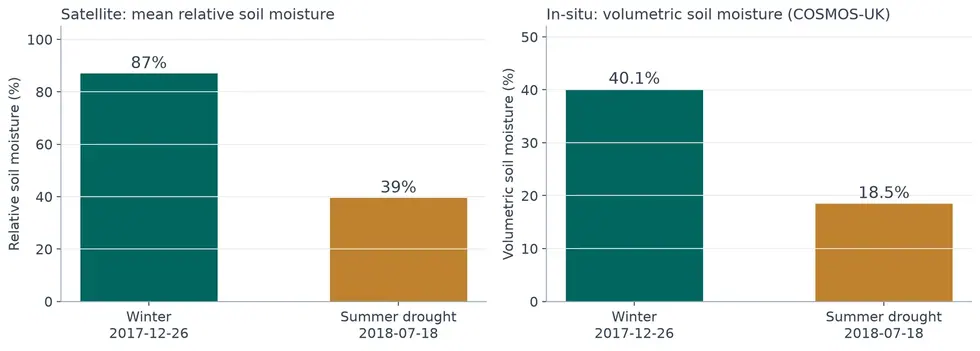
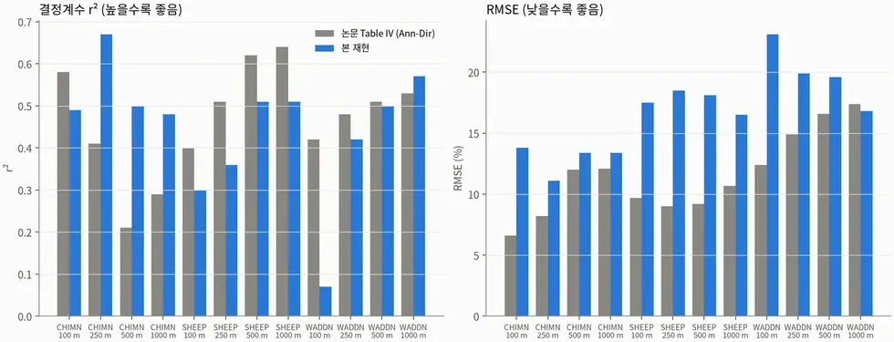

# sar/sentinel-1/water/soil-moisture

후방산란 변화로 표층 토양수분을 산출한다. 논문 3편을 수정 없이 재현했다.

## 하위

| 디렉터리 | 내용 |
|---|---|
| [`korea_gao2017/`](korea_gao2017/) | Gao 2017 (S1+S2 변화탐지) — 국내 가평·화성 적용. |
| [`pinn_cho2026/`](pinn_cho2026/) | Cho 2026 PINN-WCM 재구현 시도 (동료심사 전 논문, 검증용). |
| [`uk_maslanka2022/`](uk_maslanka2022/) | Maslanka 2022 (TU Wien 변화탐지) — 영국 COSMOS-UK 재현. |
| [`us_ma2020/`](us_ma2020/) | Ma 2020 (Oh + WCM) — 미국 SCAN 재현. **재현 실패 기록 포함.** |
| [`verify/`](verify/) | 원본 산출물에서 핵심 수치를 다시 계산해 문서와 대조한다. |
| [`viz/`](viz/) | 지도 합성·위치 정합 확인용 그림 생성. |

## 결과 예시

이 폴더 코드로 만든 산출물입니다. 데이터는 저장소에 없고 그림만 참고용으로 둡니다.

*겨울→여름 위성 평균 rSSM 87%→39%, 현장 COSMOS-UK 40.1%→18.5%*

*논문 대비 재현 결과 — r² 는 근접, RMSE 는 재현 실패*
