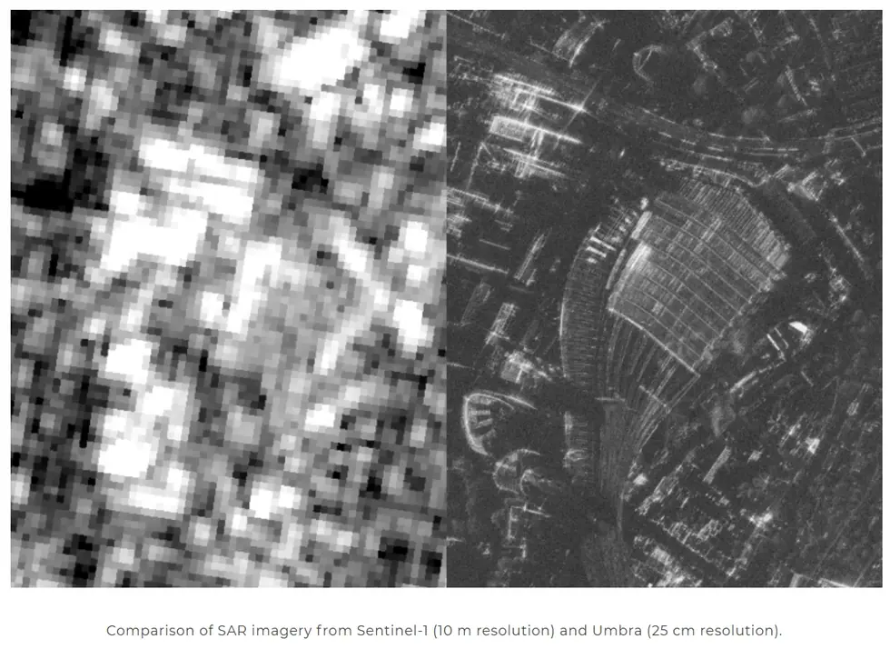

# sar/umbra

**Umbra (25 cm 상용 SAR).** SICD 복소 데이터를 직접 파싱한다.

## 하위

| 디렉터리 | 내용 |
|---|---|
| [`sigma0/`](sigma0/) | 복소 진폭 → σ⁰ 변환. |

## 결과 예시

이 폴더 코드로 만든 산출물입니다. 데이터는 저장소에 없고 그림만 참고용으로 둡니다.

*Sentinel-1 (10 m) vs Umbra (25 cm) 해상도 비교*

## 코드

| 파일 | 역할 | 입력 | 출력 |
|---|---|---|---|
| `view_umbra_sicd.py` | 아나콘다 프롬프트에서 conda activate sarpy python 12_umbra\view_umbra_sicd.py | — | — |
