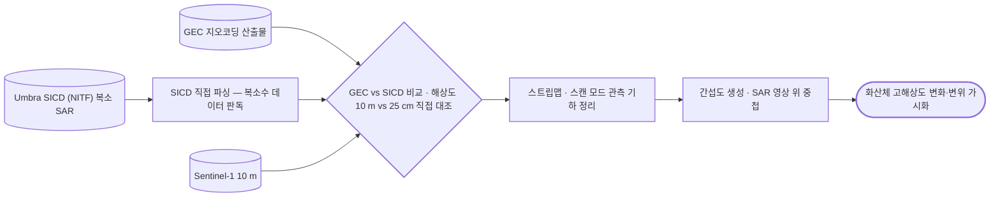

# sar/umbra

**Umbra (25 cm 상용 SAR).** SICD 복소 데이터를 직접 파싱함.

## 처리 흐름

> - 원통: 입력 자료 · 사각형: 처리 단계 · 마름모: 판정·검증 · 양끝 둥근 사각형: 산출물
> - GitHub 에서 자동 렌더링됨

---

## 하위

| 디렉터리 | 내용 |
|---|---|
| [`sigma0/`](sigma0/) | 복소 진폭 → σ⁰ 변환. |

## 코드

| 파일 | 역할 | 입력 | 출력 |
|---|---|---|---|
| `view_umbra_sicd.py` | 아나콘다 프롬프트에서 conda activate sarpy python 12_umbra\view_umbra_sicd.py | — | — |
